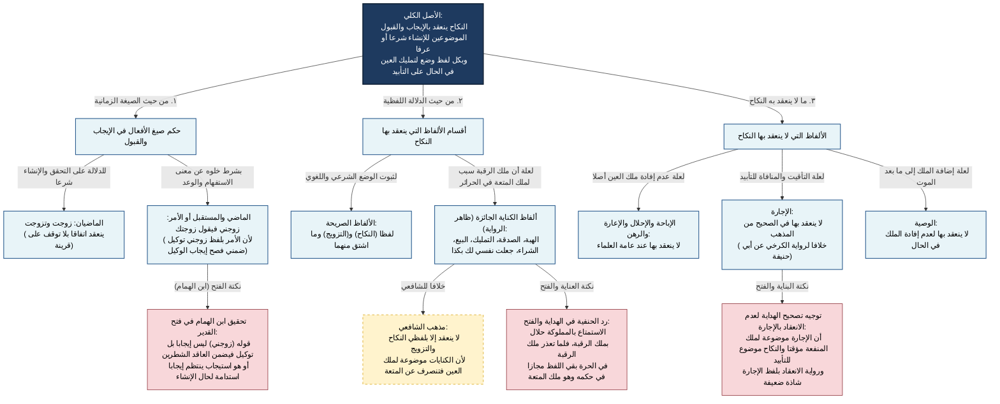

# 01_01 - الركن وألفاظ الانعقاد (الصريح والكناية وصيغ الأفعال)

```mermaid
flowchart TD
    classDef asl fill:#1e3a5f,stroke:#0f1f33,color:#ffffff,stroke-width:2px
    classDef zahir fill:#e8f4f8,stroke:#2b5c8f,color:#000000,stroke-width:1.5px
    classDef nadire fill:#e2e3e5,stroke:#41464b,color:#000000,stroke-dasharray: 3 3
    classDef hilaf fill:#fff3cd,stroke:#d39e00,color:#000000,stroke-dasharray: 5 5
    classDef serh fill:#f8d7da,stroke:#842029,color:#000000,stroke-width:1px

    ROOT["الأصل الكلي:<br/>النكاح ينعقد بالإيجاب والقبول الموضوعين للإنشاء شرعا أو عرفا<br/>وبكل لفظ وضع لتمليك العين في الحال على التأبيد"]:::asl

    ROOT -->|"١. من حيث الصيغة الزمانية"| Z["حكم صيغ الأفعال في الإيجاب والقبول"]:::zahir
    Z -->|"للدلالة على التحقق والإنشاء شرعا"| Z1["الماضيان: زوجت وتزوجت<br/>(ينعقد اتفاقا بلا توقف على قرينة)"]:::zahir
    Z -->|"بشرط خلوه عن معنى الاستفهام والوعد"| Z2["الماضي والمستقبل أو الأمر: زوجني فيقول زوجتك<br/>(لأن الأمر بلفظ زوجني توكيل ضمني فصح إيجاب الوكيل)"]:::zahir
    Z2 -->|"نكتة الفتح (ابن الهمام)"| ZS["تحقيق ابن الهمام في فتح القدير:<br/>قوله (زوجني) ليس إيجابا بل توكيل فيضمن العاقد الشطرين<br/>أو هو استيجاب ينتظم إيجابا استدامة لحال الإنشاء"]:::serh

    ROOT -->|"٢. من حيث الدلالة اللفظية"| L["أقسام الألفاظ التي ينعقد بها النكاح"]:::zahir
    L -->|"لثبوت الوضع الشرعي واللغوي"| L1["الألفاظ الصريحة:<br/>لفظا (النكاح) و(التزويج) وما اشتق منهما"]:::zahir
    L -->|"لعلة أن ملك الرقبة سبب لملك المتعة في الحرائر"| L2["ألفاظ الكناية الجائزة (ظاهر الرواية):<br/>الهبة، الصدقة، التمليك، البيع، الشراء، جعلت نفسي لك بكذا"]:::zahir
    L2 -->|"خلافا للشافعي"| LH1["مذهب الشافعي:<br/>لا ينعقد إلا بلفظي النكاح والتزويج<br/>لأن الكنايات موضوعة لملك العين فتنصرف عن المتعة"]:::hilaf
    L2 -->|"نكتة العناية والفتح"| LS1["رد الحنفية في الهداية والفتح:<br/>الاستمتاع بالمملوكة حلال بملك الرقبة، فلما تعذر ملك الرقبة<br/>في الحرة بقي اللفظ مجازا في حكمه وهو ملك المتعة"]:::serh

    ROOT -->|"٣. ما لا ينعقد به النكاح"| M["الألفاظ التي لا ينعقد بها النكاح"]:::zahir
    M -->|"لعلة عدم إفادة ملك العين أصلا"| M1["الإباحة والإحلال والإعارة والرهن:<br/>لا ينعقد بها عند عامة العلماء"]:::zahir
    M -->|"لعلة التأقيت والمنافاة للتأبيد"| M2["الإجارة:<br/>لا ينعقد بها في الصحيح من المذهب<br/>(خلافا لرواية الكرخي عن أبي حنيفة)"]:::zahir
    M -->|"لعلة إضافة الملك إلى ما بعد الموت"| M3["الوصية:<br/>لا ينعقد بها لعدم إفادة الملك في الحال"]:::zahir
    M2 -->|"نكتة البناية والفتح"| MS1["توجيه تصحيح الهداية لعدم الانعقاد بالإجارة:<br/>أن الإجارة موضوعة لملك المنفعة مؤقتا والنكاح موضوع للتأبيد<br/>ورواية الانعقاد بلفظ الإجارة شاذة ضعيفة"]:::serh
```
