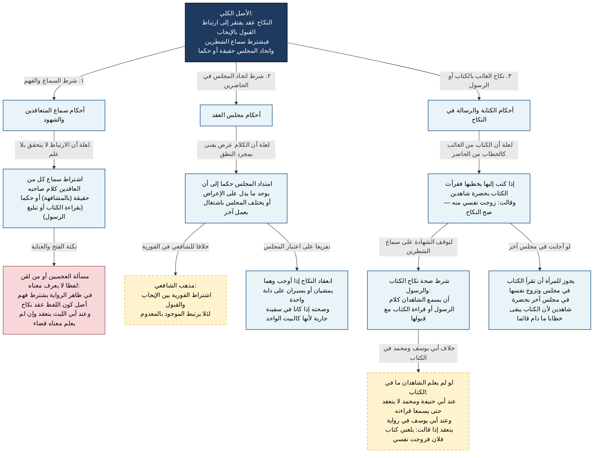

# 01_02 - اتحاد المجلس وسماع العاقدين ونكاح الغائب بالكتاب والرسول

```mermaid
flowchart TD
    classDef asl fill:#1e3a5f,stroke:#0f1f33,color:#ffffff,stroke-width:2px
    classDef zahir fill:#e8f4f8,stroke:#2b5c8f,color:#000000,stroke-width:1.5px
    classDef nadire fill:#e2e3e5,stroke:#41464b,color:#000000,stroke-dasharray: 3 3
    classDef hilaf fill:#fff3cd,stroke:#d39e00,color:#000000,stroke-dasharray: 5 5
    classDef serh fill:#f8d7da,stroke:#842029,color:#000000,stroke-width:1px

    ROOT["الأصل الكلي:<br/>النكاح عقد يفتقر إلى ارتباط القبول بالإيجاب<br/>فيشترط سماع الشطرين واتحاد المجلس حقيقة أو حكما"]:::asl

    ROOT -->|"١. شرط السماع والفهم"| S["أحكام سماع المتعاقدين والشهود"]:::zahir
    S -->|"لعلة أن الارتباط لا يتحقق بلا علم"| S1["اشتراط سماع كل من العاقدين كلام صاحبه<br/>حقيقة (بالمشافهة) أو حكما (بقراءة الكتاب أو تبليغ الرسول)"]:::zahir
    S1 -->|"نكتة الفتح والعناية"| SS1["مسألة العجميين أو من لقن لفظا لا يعرف معناه:<br/>في ظاهر الرواية يشترط فهم أصل كون اللفظ عقد نكاح<br/>وعند أبي الليث ينعقد وإن لم يعلم معناه قضاء"]:::serh

    ROOT -->|"٢. شرط اتحاد المجلس في الحاضرين"| M["أحكام مجلس العقد"]:::zahir
    M -->|"لعلة أن الكلام عرض يفنى بمجرد النطق"| M1["امتداد المجلس حكما إلى أن يوجد ما يدل على الإعراض<br/>أو يختلف المجلس باشتغال بعمل آخر"]:::zahir
    M1 -->|"خلافا للشافعي في الفورية"| MH1["مذهب الشافعي:<br/>اشتراط الفورية بين الإيجاب والقبول<br/>لئلا يرتبط الموجود بالمعدوم"]:::hilaf
    M1 -->|"تفريعا على اعتبار المجلس"| M2["انعقاد النكاح إذا أوجب وهما يمشيان أو يسيران على دابة واحدة<br/>وصحته إذا كانا في سفينة جارية لأنها كالبيت الواحد"]:::zahir

    ROOT -->|"٣. نكاح الغائب بالكتاب أو الرسول"| G["أحكام الكتابة والرسالة في النكاح"]:::zahir
    G -->|"لعلة أن الكتاب من الغائب كالخطاب من الحاضر"| G1["إذا كتب إليها يخطبها فقرأت الكتاب بحضرة شاهدين<br/>وقالت: زوجت نفسي منه — صح النكاح"]:::zahir
    G1 -->|"لتوقف الشهادة على سماع الشطرين"| G2["شرط صحة نكاح الكتاب والرسول:<br/>أن يسمع الشاهدان كلام الرسول أو قراءة الكتاب مع قبولها"]:::zahir
    G2 -->|"خلاف أبي يوسف ومحمد في الكتاب"| GH1["لو لم يعلم الشاهدان ما في الكتاب:<br/>عند أبي حنيفة ومحمد لا ينعقد حتى يسمعا قراءته<br/>وعند أبي يوسف في رواية ينعقد إذا قالت: بلغني كتاب فلان فزوجت نفسي"]:::hilaf
    G1 -->|"لو أجابت في مجلس آخر"| G3["يجوز للمرأة أن تقرأ الكتاب في مجلس وتزوج نفسها<br/>في مجلس آخر بحضرة شاهدين لأن الكتاب يبقى خطابا ما دام قائما"]:::zahir
```
