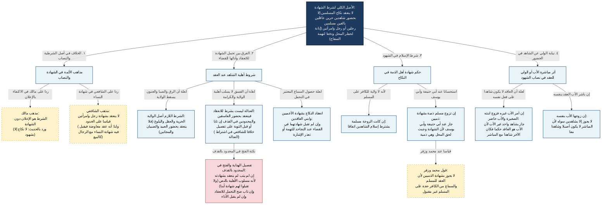

# 01_03 - شرط الشهادة وأهلية الشهود في النكاح

```mermaid
flowchart TD
    classDef asl fill:#1e3a5f,stroke:#0f1f33,color:#ffffff,stroke-width:2px
    classDef zahir fill:#e8f4f8,stroke:#2b5c8f,color:#000000,stroke-width:1.5px
    classDef nadire fill:#e2e3e5,stroke:#41464b,color:#000000,stroke-dasharray: 3 3
    classDef hilaf fill:#fff3cd,stroke:#d39e00,color:#000000,stroke-dasharray: 5 5
    classDef serh fill:#f8d7da,stroke:#842029,color:#000000,stroke-width:1px

    ROOT["الأصل الكلي لشرط الشهادة:<br/>لا ينعقد نكاح المسلمين إلا بحضور شاهدين حرين عاقلين بالغين مسلمين<br/>رجلين أو رجل وامرأتين (إبانة لخطر المحل ودفعا لتهمة السفاح)"]:::asl

    ROOT -->|"١. الخلاف في أصل الشرطية والنصاب"| K["مذاهب الأئمة في الشهادة والنصاب"]:::zahir
    K -->|"ردا على مالك في الاكتفاء بالإعلان"| KH1["مذهب مالك:<br/>الشرط هو الإعلان دون الشهادة<br/>(ورد بالحديث: لا نكاح إلا بشهود)"]:::hilaf
    K -->|"ردا على الشافعي في شهادة النساء"| KH2["مذهب الشافعي:<br/>لا ينعقد بشهادة رجل وامرأتين قياسا على الحدود<br/>(ولنا: أنه عقد معاوضة فيقبل فيه شهادة النساء مع الرجال كالبيع)"]:::hilaf

    ROOT -->|"٢. الفرق بين تحمل الشهادة للانعقاد وأدائها للقضاء"| A["شروط أهلية الشاهد عند العقد"]:::zahir
    A -->|"لعلة أن الرق والصبا والجنون يسقط الولاية"| A1["الشرط اللازم أصل الولاية:<br/>الحرية والعقل والبلوغ (فلا ينعقد بحضور العبيد والصبيان والمجانين)"]:::zahir
    A -->|"لعلة أن الفسق لا يسلب أهلية الولاية والكرامة"| A2["العدالة ليست بشرط للانعقاد:<br/>فينعقد بحضور الفاسقين والمحدودين في القذف إن تابا أو قبل التوبة على تفصيل<br/>(خلافا للشافعي في اشتراط العدالة)"]:::zahir
    A -->|"لعلة حصول السماع المعتبر في التحمل"| A3["انعقاد النكاح بشهادة الأعميين وابني العاقدين:<br/>وإن لم تقبل شهادتهما في القضاء عند التجاحد للتهمة أو تعذر الإشارة"]:::zahir
    A2 -->|"نكتة الفتح في المحدود بالقذف"| AS1["تفصيل الهداية والفتح في المحدود بالقذف:<br/>إن لم يتب لم ينعقد بشهادته لأنه مسلوب الأهلية بالنص (ولا تقبلوا لهم شهادة أبدا)<br/>وإن تاب صح التحمل للانعقاد وإن لم يقبل الأداء"]:::serh

    ROOT -->|"٣. شرط الإسلام في الشهود"| I["حكم شهادة أهل الذمة في النكاح"]:::zahir
    I -->|"لأنه لا ولاية للكافر على المسلم"| I1["إن كانت الزوجة مسلمة:<br/>يشترط إسلام الشاهدين اتفاقا"]:::zahir
    I -->|"استحسانا عند أبي حنيفة وأبي يوسف"| I2["إن تزوج مسلم ذمية بشهادة ذميين:<br/>جاز عند أبي حنيفة وأبي يوسف لأن الشهادة وجبت لحق المحل وهي ذمية"]:::zahir
    I2 -->|"قياسا عند محمد وزفر"| IH1["قول محمد وزفر:<br/>لا يجوز بشهادة الذميين لأن العقد للمسلم<br/>والسماع من الكافر حجة على المسلم غير مقبول"]:::hilaf

    ROOT -->|"٤. نيابة الولي عن الشاهد في الحضور"| W["أثر مباشرة الأب أو الولي للعقد في نصاب الشهود"]:::zahir
    W -->|"لعلة أن العاقد لا يكون شاهدا على فعل نفسه"| W1["إن أمر الأب غيره فزوج ابنته الصغيرة والأب حاضر:<br/>جاز بشاهد واحد غير الأب لأن الأب هو العاقد حكما فكان الآخر شاهدا مع المباشر"]:::zahir
    W -->|"إن باشر الأب العقد بنفسه"| W2["إن زوجها الأب بنفسه:<br/>لا يجوز إلا بشاهدين سواه لأن المباشر لا يكون أصيلا وشاهدا معا"]:::zahir
```
