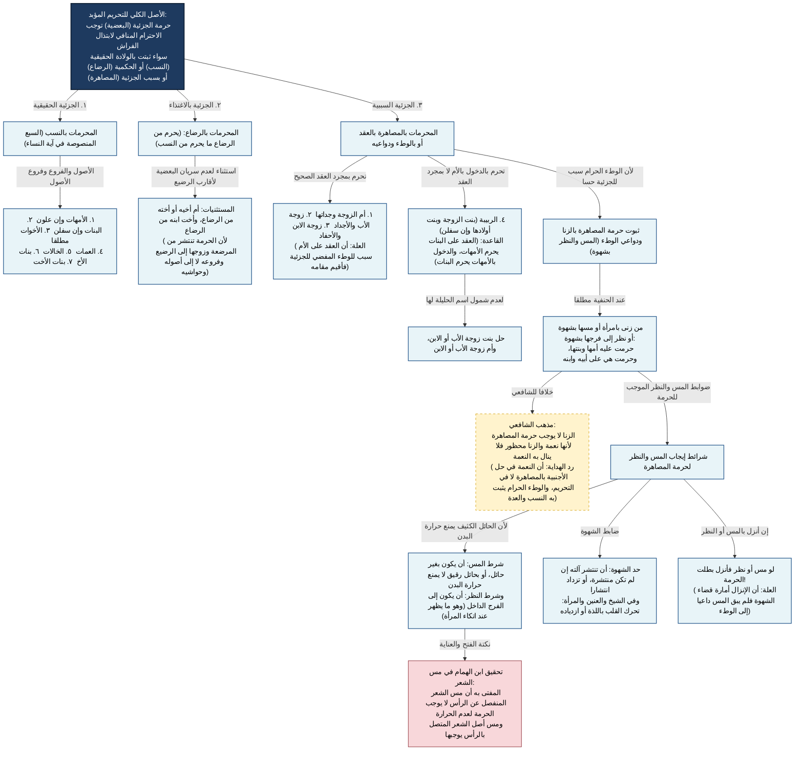

# 02_01 - المحرمات بالنسب والرضاع والمصاهرة (وتفريعات الزنا والمس بشهوة)

```mermaid
flowchart TD
    classDef asl fill:#1e3a5f,stroke:#0f1f33,color:#ffffff,stroke-width:2px
    classDef zahir fill:#e8f4f8,stroke:#2b5c8f,color:#000000,stroke-width:1.5px
    classDef nadire fill:#e2e3e5,stroke:#41464b,color:#000000,stroke-dasharray: 3 3
    classDef hilaf fill:#fff3cd,stroke:#d39e00,color:#000000,stroke-dasharray: 5 5
    classDef serh fill:#f8d7da,stroke:#842029,color:#000000,stroke-width:1px

    ROOT["الأصل الكلي للتحريم المؤبد:<br/>حرمة الجزئية (البعضية) توجب الاحترام المنافي لابتذال الفراش<br/>سواء ثبتت بالولادة الحقيقية (النسب) أو الحكمية (الرضاع) أو بسبب الجزئية (المصاهرة)"]:::asl

    ROOT -->|"١. الجزئية الحقيقية"| N["المحرمات بالنسب (السبع المنصوصة في آية النساء)"]:::zahir
    N -->|"الأصول والفروع وفروع الأصول"| N1["١. الأمهات وإن علون  ٢. البنات وإن سفلن  ٣. الأخوات مطلقا<br/>٤. العمات  ٥. الخالات  ٦. بنات الأخ  ٧. بنات الأخت"]:::zahir

    ROOT -->|"٢. الجزئية بالاغتذاء"| R["المحرمات بالرضاع: (يحرم من الرضاع ما يحرم من النسب)"]:::zahir
    R -->|"استثناء لعدم سريان البعضية لأقارب الرضيع"| R1["المستثنيات: أم أخيه أو أخته من الرضاع، وأخت ابنه من الرضاع<br/>(لأن الحرمة تنتشر من المرضعة وزوجها إلى الرضيع وفروعه لا إلى أصوله وحواشيه)"]:::zahir

    ROOT -->|"٣. الجزئية السببية"| M["المحرمات بالمصاهرة بالعقد أو بالوطء ودواعيه"]:::zahir
    M -->|"تحرم بمجرد العقد الصحيح"| M1["١. أم الزوجة وجداتها  ٢. زوجة الأب والأجداد  ٣. زوجة الابن والأحفاد<br/>(العلة: أن العقد على الأم سبب للوطء المفضي للجزئية فأقيم مقامه)"]:::zahir
    M -->|"تحرم بالدخول بالأم لا بمجرد العقد"| M2["٤. الربيبة (بنت الزوجة وبنت أولادها وإن سفلن)<br/>القاعدة: (العقد على البنات يحرم الأمهات، والدخول بالأمهات يحرم البنات)"]:::zahir
    M2 -->|"لعدم شمول اسم الحليلة لها"| M3["حل بنت زوجة الأب أو الابن، وأم زوجة الأب أو الابن"]:::zahir

    M -->|"لأن الوطء الحرام سبب للجزئية حسا"| Z["ثبوت حرمة المصاهرة بالزنا ودواعي الوطء (المس والنظر بشهوة)"]:::zahir
    Z -->|"عند الحنفية مطلقا"| Z1["من زنى بامرأة أو مسها بشهوة أو نظر إلى فرجها بشهوة:<br/>حرمت عليه أمها وبنتها، وحرمت هي على أبيه وابنه"]:::zahir
    Z1 -->|"خلافا للشافعي"| ZH1["مذهب الشافعي:<br/>الزنا لا يوجب حرمة المصاهرة لأنها نعمة والزنا محظور فلا ينال به النعمة<br/>(رد الهداية: أن النعمة في حل الأجنبية بالمصاهرة لا في التحريم، والوطء الحرام يثبت به النسب والعدة)"]:::hilaf

    Z1 -->|"ضوابط المس والنظر الموجب للحرمة"| D["شرائط إيجاب المس والنظر لحرمة المصاهرة"]:::zahir
    D -->|"لأن الحائل الكثيف يمنع حرارة البدن"| D1["شرط المس: أن يكون بغير حائل، أو بحائل رقيق لا يمنع حرارة البدن<br/>وشرط النظر: أن يكون إلى الفرج الداخل (وهو ما يظهر عند اتكاء المرأة)"]:::zahir
    D -->|"ضابط الشهوة"| D2["حد الشهوة: أن تنتشر آلته إن لم تكن منتشرة، أو تزداد انتشارا<br/>وفي الشيخ والعنين والمرأة: تحرك القلب باللذة أو ازدياده"]:::zahir
    D -->|"إن أنزل بالمس أو النظر"| D3["لو مس أو نظر فأنزل بطلت الحرمة!<br/>(العلة: أن الإنزال أمارة قضاء الشهوة فلم يبق المس داعيا إلى الوطء)"]:::zahir
    D1 -->|"نكتة الفتح والعناية"| DS["تحقيق ابن الهمام في مس الشعر:<br/>المفتى به أن مس الشعر المنفصل عن الرأس لا يوجب الحرمة لعدم الحرارة<br/>ومس أصل الشعر المتصل بالرأس يوجبها"]:::serh
```
