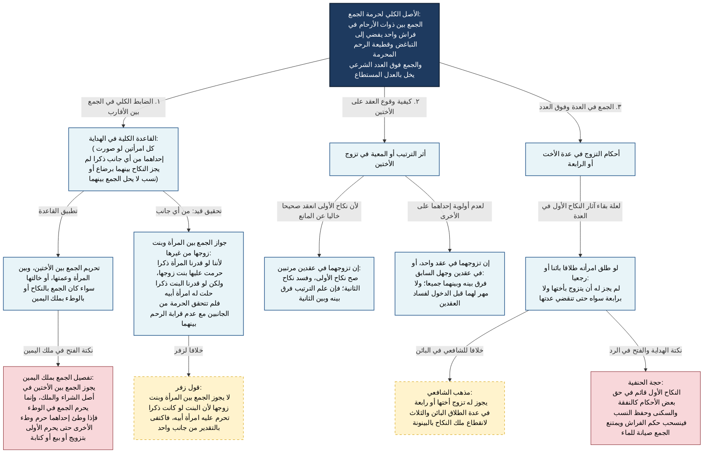

# 02_02 - حرمة الجمع وضابطها الأصولي وأحكام العدة والعدد

```mermaid
flowchart TD
    classDef asl fill:#1e3a5f,stroke:#0f1f33,color:#ffffff,stroke-width:2px
    classDef zahir fill:#e8f4f8,stroke:#2b5c8f,color:#000000,stroke-width:1.5px
    classDef nadire fill:#e2e3e5,stroke:#41464b,color:#000000,stroke-dasharray: 3 3
    classDef hilaf fill:#fff3cd,stroke:#d39e00,color:#000000,stroke-dasharray: 5 5
    classDef serh fill:#f8d7da,stroke:#842029,color:#000000,stroke-width:1px

    ROOT["الأصل الكلي لحرمة الجمع:<br/>الجمع بين ذوات الأرحام في فراش واحد يفضي إلى التباغض وقطيعة الرحم المحرمة<br/>والجمع فوق العدد الشرعي يخل بالعدل المستطاع"]:::asl

    ROOT -->|"١. الضابط الكلي في الجمع بين الأقارب"| Q["القاعدة الكلية في الهداية:<br/>(كل امرأتين لو صورت إحداهما من أي جانب ذكرا لم يجز النكاح بينهما برضاع أو نسب لا يحل الجمع بينهما)"]:::zahir
    Q -->|"تطبيق القاعدة"| Q1["تحريم الجمع بين الأختين، وبين المرأة وعمتها، أو خالتها<br/>سواء كان الجمع بالنكاح أو بالوطء بملك اليمين"]:::zahir
    Q -->|"تحقيق قيد: من أي جانب"| Q2["جواز الجمع بين المرأة وبنت زوجها من غيرها:<br/>لأننا لو قدرنا المرأة ذكرا حرمت عليها بنت زوجها، ولكن لو قدرنا البنت ذكرا حلت له امرأة أبيه<br/>فلم تتحقق الحرمة من الجانبين مع عدم قرابة الرحم بينهما"]:::zahir
    Q2 -->|"خلافا لزفر"| QH1["قول زفر:<br/>لا يجوز الجمع بين المرأة وبنت زوجها لأن البنت لو كانت ذكرا<br/>تحرم عليه امرأة أبيه، فاكتفى بالتقدير من جانب واحد"]:::hilaf
    Q1 -->|"نكتة الفتح في ملك اليمين"| QS["تفصيل الجمع بملك اليمين:<br/>يجوز الجمع بين الأختين في أصل الشراء والملك، وإنما يحرم الجمع في الوطء<br/>فإذا وطئ إحداهما حرم وطء الأخرى حتى يحرم الأولى بتزويج أو بيع أو كتابة"]:::serh

    ROOT -->|"٢. كيفية وقوع العقد على الأختين"| A["أثر الترتيب أو المعية في تزوج الأختين"]:::zahir
    A -->|"لأن نكاح الأولى انعقد صحيحا خاليا عن المانع"| A1["إن تزوجهما في عقدين مرتبين:<br/>صح نكاح الأولى، وفسد نكاح الثانية؛ فإن علم الترتيب فرق بينه وبين الثانية"]:::zahir
    A -->|"لعدم أولوية إحداهما على الأخرى"| A2["إن تزوجهما في عقد واحد، أو في عقدين وجهل السابق:<br/>فرق بينه وبينهما جميعا؛ ولا مهر لهما قبل الدخول لفساد العقدين"]:::zahir

    ROOT -->|"٣. الجمع في العدة وفوق العدد"| I["أحكام التزوج في عدة الأخت أو الرابعة"]:::zahir
    I -->|"لعلة بقاء آثار النكاح الأول في العدة"| I1["لو طلق امرأته طلاقا بائنا أو رجعيا:<br/>لم يجز له أن يتزوج بأختها ولا برابعة سواه حتى تنقضي عدتها"]:::zahir
    I1 -->|"خلافا للشافعي في البائن"| IH1["مذهب الشافعي:<br/>يجوز له تزوج أختها أو رابعة في عدة الطلاق البائن والثلاث<br/>لانقطاع ملك النكاح بالبينونة"]:::hilaf
    I1 -->|"نكتة الهداية والفتح في الرد"| IS1["حجة الحنفية:<br/>النكاح الأول قائم في حق بعض الأحكام كالنفقة والسكنى وحفظ النسب<br/>فينسحب حكم الفراش ويمتنع الجمع صيانة للماء"]:::serh
```
