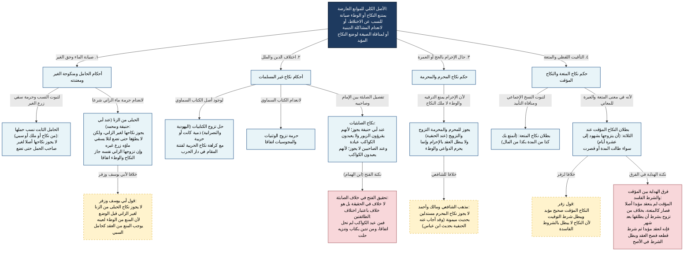

# 02_03 - المحرمات لحق الغير واختلاف الدين والإحرام ونكاح المتعة والمؤقت

```mermaid
flowchart TD
    classDef asl fill:#1e3a5f,stroke:#0f1f33,color:#ffffff,stroke-width:2px
    classDef zahir fill:#e8f4f8,stroke:#2b5c8f,color:#000000,stroke-width:1.5px
    classDef nadire fill:#e2e3e5,stroke:#41464b,color:#000000,stroke-dasharray: 3 3
    classDef hilaf fill:#fff3cd,stroke:#d39e00,color:#000000,stroke-dasharray: 5 5
    classDef serh fill:#f8d7da,stroke:#842029,color:#000000,stroke-width:1px

    ROOT["الأصل الكلي للموانع العارضة:<br/>يمتنع النكاح أو الوطء صيانة للنسب عن الاختلاط، أو لانعدام المشاكلة الدينية<br/>أو لمنافاة الصيغة لوضع النكاح المؤبد"]:::asl

    ROOT -->|"١. صيانة الماء وحق الغير"| H["أحكام الحامل ومنكوحة الغير ومعتدته"]:::zahir
    H -->|"لثبوت النسب وحرمة سقي زرع الغير"| H1["الحامل الثابت نسب حملها (من نكاح أو ملك أو سبي):<br/>لا يجوز نكاحها أصلا لغير صاحب الحمل حتى تضع"]:::zahir
    H -->|"لانعدام حرمة ماء الزاني شرعا"| H2["الحبلى من الزنا (عند أبي حنيفة ومحمد):<br/>يجوز نكاحها لغير الزاني، ولكن لا يطؤها حتى تضع لئلا يسقي ماؤه زرع غيره<br/>وإن تزوجها الزاني نفسه جاز النكاح والوطء اتفاقا"]:::zahir
    H2 -->|"خلافا لأبي يوسف وزفر"| HH1["قول أبي يوسف وزفر:<br/>لا يجوز نكاح الحبلى من الزنا لغير الزاني قبل الوضع<br/>لأن المنع من الوطء لعينه يوجب المنع من العقد كحامل السبي"]:::hilaf

    ROOT -->|"٢. اختلاف الدين والملل"| D["أحكام نكاح غير المسلمات"]:::zahir
    D -->|"لوجود أصل الكتاب السماوي"| D1["حل تزوج الكتابيات (اليهودية والنصرانية) ذمية كانت أو حربية<br/>مع كراهة نكاح الحربية لفتنة المقام في دار الحرب"]:::zahir
    D -->|"لانعدام الكتاب السماوي"| D2["حرمة تزوج الوثنيات والمجوسيات اتفاقا"]:::zahir
    D -->|"تفصيل الصابئة بين الإمام وصاحبيه"| D3["نكاح الصابئيات:<br/>عند أبي حنيفة يجوز؛ لأنهم يقرؤون الزبور ولا يعبدون الكواكب عبادة<br/>وعند الصاحبين لا يجوز؛ لأنهم يعبدون الكواكب"]:::zahir
    D3 -->|"نكتة الفتح (ابن الهمام)"| DS["تحقيق الفتح في خلاف الصابئة:<br/>لا خلاف في الحقيقة بل هو خلاف باعتبار اختلاف الطائفتين:<br/>فمن عبد الكواكب لم تحل اتفاقا، ومن تدين بكتاب وتنزيه حلت"]:::serh

    ROOT -->|"٣. حال الإحرام بالحج أو العمرة"| IH["حكم نكاح المحرم والمحرمة"]:::zahir
    IH -->|"لأن الإحرام يمنع الترفيه والوطء لا ملك النكاح"| IH1["يجوز للمحرم والمحرمة التزوج والتزويج (عند الحنفية)<br/>ولا يبطل العقد بالإحرام وإنما يحرم الدواعي والوطء"]:::zahir
    IH1 -->|"خلافا للشافعي"| IHH["مذهب الشافعي ومالك وأحمد:<br/>لا يجوز نكاح المحرم مستدلين بحديث ميمونة (وقد أجاب عنه الحنفية بحديث ابن عباس)"]:::hilaf

    ROOT -->|"٤. التأقيت اللفظي والمتعة"| M["حكم نكاح المتعة والنكاح المؤقت"]:::zahir
    M -->|"لثبوت النسخ الإجماعي ومنافاة التأبيد"| M1["بطلان نكاح المتعة: (أتمتع بك كذا من المدة بكذا من المال)"]:::zahir
    M -->|"لأنه في معنى المتعة والعبرة للمعاني"| M2["بطلان النكاح المؤقت عند الثلاثة: (أن يتزوجها بشهود إلى عشرة أيام)<br/>سواء طالت المدة أو قصرت"]:::zahir
    M2 -->|"خلافا لزفر"| MH["قول زفر:<br/>النكاح المؤقت صحيح مؤبد ويبطل شرط التوقيت<br/>لأن النكاح لا يبطل بالشروط الفاسدة"]:::hilaf
    M2 -->|"نكتة الهداية في الفرق"| MS["فرق الهداية بين المؤقت والشرط الفاسد:<br/>المؤقت لم ينعقد مؤبدا أصلا فصار كالمتعة، بخلاف من تزوج بشرط أن يطلقها بعد شهر<br/>فإنه انعقد مؤبدا ثم شرط قطعه فصح العقد وبطل الشرط في الأصح"]:::serh
```
