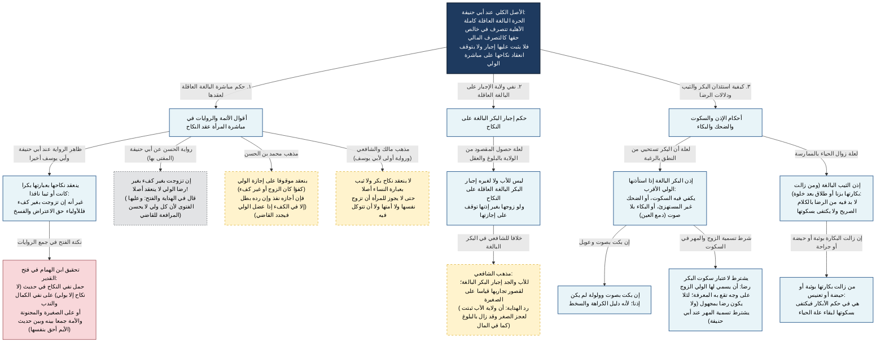

# 03_01 - ولاية المرأة على نفسها وتحرير الروايات واستئذان البكر والثيب

```mermaid
flowchart TD
    classDef asl fill:#1e3a5f,stroke:#0f1f33,color:#ffffff,stroke-width:2px
    classDef zahir fill:#e8f4f8,stroke:#2b5c8f,color:#000000,stroke-width:1.5px
    classDef nadire fill:#e2e3e5,stroke:#41464b,color:#000000,stroke-dasharray: 3 3
    classDef hilaf fill:#fff3cd,stroke:#d39e00,color:#000000,stroke-dasharray: 5 5
    classDef serh fill:#f8d7da,stroke:#842029,color:#000000,stroke-width:1px

    ROOT["الأصل الكلي عند أبي حنيفة:<br/>الحرة البالغة العاقلة كاملة الأهلية تتصرف في خالص حقها كالتصرف المالي<br/>فلا يثبت عليها إجبار ولا يتوقف انعقاد نكاحها على مباشرة الولي"]:::asl

    ROOT -->|"١. حكم مباشرة البالغة العاقلة لعقدها"| A["أقوال الأئمة والروايات في مباشرة المرأة عقد النكاح"]:::zahir
    A -->|"ظاهر الرواية عند أبي حنيفة وأبي يوسف أخيرا"| A1["ينعقد نكاحها بعبارتها بكرا كانت أو ثيبا نافذا:<br/>غير أنه إن تزوجت بغير كفء فللأولياء حق الاعتراض والفسخ"]:::zahir
    A -->|"رواية الحسن عن أبي حنيفة (المفتى بها)"| AN["إن تزوجت بغير كفء بغير رضا الولي لا ينعقد أصلا!<br/>(قال في الهداية والفتح: وعليها الفتوى لأن كل ولي لا يحسن المرافعة للقاضي)"]:::nadire
    A -->|"مذهب محمد بن الحسن"| AH1["ينعقد موقوفا على إجازة الولي (كفؤا كان الزوج أو غير كفء)<br/>فإن أجازه نفذ وإن رده بطل (إلا في الكفء إذا عضل الولي فيجدد القاضي)"]:::hilaf
    A -->|"مذهب مالك والشافعي (ورواية أولى لأبي يوسف)"| AH2["لا ينعقد نكاح بكر ولا ثيب بعبارة النساء أصلا<br/>حتى لا يجوز للمرأة أن تزوج نفسها ولا أمتها ولا أن تتوكل فيه"]:::hilaf
    A1 -->|"نكتة الفتح في جمع الروايات"| AS1["تحقيق ابن الهمام في فتح القدير:<br/>حمل نفي النكاح في حديث (لا نكاح إلا بولي) على نفي الكمال والندب<br/>أو على الصغيرة والمجنونة والأمة جمعا بينه وبين حديث (الأيم أحق بنفسها)"]:::serh

    ROOT -->|"٢. نفي ولاية الإجبار على البالغة العاقلة"| B["حكم إجبار البكر البالغة على النكاح"]:::zahir
    B -->|"لعلة حصول المقصود من الولاية بالبلوغ والعقل"| B1["ليس للأب ولا لغيره إجبار البكر البالغة العاقلة على النكاح<br/>ولو زوجها بغير إذنها توقف على إجازتها"]:::zahir
    B1 -->|"خلافا للشافعي في البكر البالغة"| BH1["مذهب الشافعي:<br/>للأب والجد إجبار البكر البالغة؛ لقصور تجاربها قياسا على الصغيرة<br/>(رد الهداية: أن ولاية الأب ثبتت لعجز الصغر وقد زال بالبلوغ كما في المال)"]:::hilaf

    ROOT -->|"٣. كيفية استئذان البكر والثيب ودلالات الرضا"| C["أحكام الإذن والسكوت والضحك والبكاء"]:::zahir
    C -->|"لعلة أن البكر تستحيي من النطق بالرغبة"| C1["إذن البكر البالغة إذا استأذنها الولي الأقرب:<br/>يكفي فيه السكوت، أو الضحك غير المستهزئ، أو البكاء بلا صوت (دمع العين)"]:::zahir
    C1 -->|"إن بكت بصوت وعويل"| C2["إن بكت بصوت وولولة لم يكن إذنا؛ لأنه دليل الكراهة والسخط"]:::zahir
    C1 -->|"شرط تسمية الزوج والمهر في السكوت"| C3["يشترط لاعتبار سكوت البكر رضا: أن يسمي لها الولي الزوج<br/>على وجه تقع به المعرفة؛ لئلا يكون رضا بمجهول (ولا يشترط تسمية المهر عند أبي حنيفة)"]:::zahir
    C -->|"لعلة زوال الحياء بالممارسة"| C4["إذن الثيب البالغة (ومن زالت بكارتها بزنا أو طلاق بعد خلوة):<br/>لا بد فيه من الرضا بالكلام الصريح ولا يكتفى بسكوتها"]:::zahir
    C4 -->|"إن زالت البكارة بوثبة أو حيضة أو جراحة"| C5["من زالت بكارتها بوثبة أو حيضة أو تعنيس:<br/>هي في حكم الأبكار فيكتفى بسكوتها لبقاء علة الحياء"]:::zahir
```
