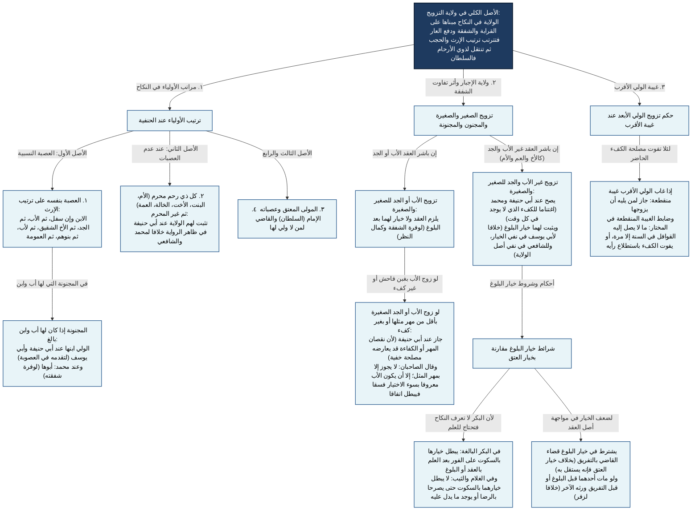

# 03_02 - ترتيب الأولياء وولاية الإجبار وخيار البلوغ والغيبة المنقطعة

```mermaid
flowchart TD
    classDef asl fill:#1e3a5f,stroke:#0f1f33,color:#ffffff,stroke-width:2px
    classDef zahir fill:#e8f4f8,stroke:#2b5c8f,color:#000000,stroke-width:1.5px
    classDef nadire fill:#e2e3e5,stroke:#41464b,color:#000000,stroke-dasharray: 3 3
    classDef hilaf fill:#fff3cd,stroke:#d39e00,color:#000000,stroke-dasharray: 5 5
    classDef serh fill:#f8d7da,stroke:#842029,color:#000000,stroke-width:1px

    ROOT["الأصل الكلي في ولاية التزويج:<br/>الولاية في النكاح مبناها على القرابة والشفقة ودفع العار<br/>فتترتب ترتيب الإرث والحجب ثم تنتقل لذوي الأرحام فالسلطان"]:::asl

    ROOT -->|"١. مراتب الأولياء في النكاح"| T["ترتيب الأولياء عند الحنفية"]:::zahir
    T -->|"الأصل الأول: العصبة النسبية"| T1["١. العصبة بنفسه على ترتيب الإرث:<br/>الابن وإن سفل، ثم الأب، ثم الجد، ثم الأخ الشقيق، ثم لأب، ثم بنوهم، ثم العمومة"]:::zahir
    T1 -->|"في المجنونة التي لها أب وابن"| T1_M["المجنونة إذا كان لها أب وابن بالغ:<br/>الولي ابنها عند أبي حنيفة وأبي يوسف (لتقدمه في العصوبة)<br/>وعند محمد: أبوها (لوفرة شفقته)"]:::zahir
    T -->|"الأصل الثاني: عند عدم العصبات"| T2["٢. كل ذي رحم محرم (الأم، البنت، الأخت، الخالة، العمة) ثم غير المحرم:<br/>تثبت لهم الولاية عند أبي حنيفة في ظاهر الرواية خلافا لمحمد والشافعي"]:::zahir
    T -->|"الأصل الثالث والرابع"| T3["٣. المولى المعتق وعصباته  ٤. الإمام (السلطان) والقاضي لمن لا ولي لها"]:::zahir

    ROOT -->|"٢. ولاية الإجبار وأثر تفاوت الشفقة"| J["تزويج الصغير والصغيرة والمجنون والمجنونة"]:::zahir
    J -->|"إن باشر العقد الأب أو الجد"| J1["تزويج الأب أو الجد للصغير والصغيرة:<br/>يلزم العقد ولا خيار لهما بعد البلوغ (لوفرة الشفقة وكمال النظر)"]:::zahir
    J1 -->|"لو زوج الأب بغبن فاحش أو غير كفء"| J1_G["لو زوج الأب أو الجد الصغيرة بأقل من مهر مثلها أو بغير كفء:<br/>جاز عند أبي حنيفة (لأن نقصان المهر أو الكفاءة قد يعارضه مصلحة خفية)<br/>وقال الصاحبان: لا يجوز إلا بمهر المثل؛ إلا أن يكون الأب معروفا بسوء الاختيار فسقا فيبطل اتفاقا"]:::zahir
    J -->|"إن باشر العقد غير الأب والجد (كالأخ والعم والأم)"| J2["تزويج غير الأب والجد للصغير والصغيرة:<br/>يصح عند أبي حنيفة ومحمد (اغتناما للكفء الذي لا يوجد في كل وقت)<br/>ويثبت لهما خيار البلوغ (خلافا لأبي يوسف في نفي الخيار، وللشافعي في نفي أصل الولاية)"]:::zahir

    J2 -->|"أحكام وشروط خيار البلوغ"| K["شرائط خيار البلوغ مقارنة بخيار العتق"]:::zahir
    K -->|"لأن البكر لا تعرف النكاح فتحتاج للعلم"| K1["في البكر البالغة: يبطل خيارها بالسكوت على الفور بعد العلم بالعقد أو البلوغ<br/>وفي الغلام والثيب: لا يبطل خيارهما بالسكوت حتى يصرحا بالرضا أو يوجد ما يدل عليه"]:::zahir
    K -->|"لضعف الخيار في مواجهة أصل العقد"| K2["يشترط في خيار البلوغ قضاء القاضي بالتفريق (بخلاف خيار العتق فإنه يستقل به)<br/>ولو مات أحدهما قبل البلوغ أو قبل التفريق ورثه الآخر (خلافا لزفر)"]:::zahir

    ROOT -->|"٣. غيبة الولي الأقرب"| G["حكم تزويج الولي الأبعد عند غيبة الأقرب"]:::zahir
    G -->|"لئلا تفوت مصلحة الكفء الحاضر"| G1["إذا غاب الولي الأقرب غيبة منقطعة: جاز لمن يليه أن يزوجها<br/>وضابط الغيبة المنقطعة في المختار: ما لا يصل إليه القوافل في السنة إلا مرة، أو يفوت الكفء باستطلاع رأيه"]:::zahir
```
