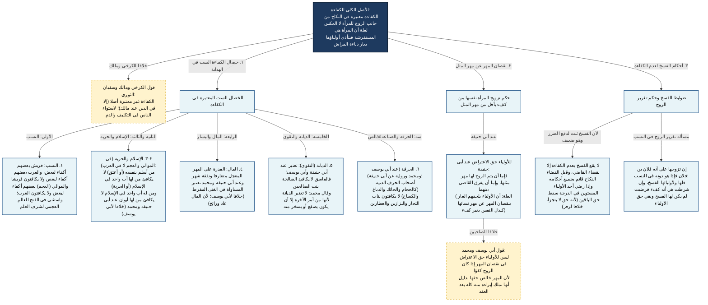

# 03_03 - الكفاءة في النكاح وخصالها الست وحكم نقصان المهر

```mermaid
flowchart TD
    classDef asl fill:#1e3a5f,stroke:#0f1f33,color:#ffffff,stroke-width:2px
    classDef zahir fill:#e8f4f8,stroke:#2b5c8f,color:#000000,stroke-width:1.5px
    classDef nadire fill:#e2e3e5,stroke:#41464b,color:#000000,stroke-dasharray: 3 3
    classDef hilaf fill:#fff3cd,stroke:#d39e00,color:#000000,stroke-dasharray: 5 5
    classDef serh fill:#f8d7da,stroke:#842029,color:#000000,stroke-width:1px

    ROOT["الأصل الكلي للكفاءة:<br/>الكفاءة معتبرة في النكاح من جانب الزوج للمرأة لا العكس<br/>لعلة أن المرأة هي المستفرشة فيتأذى أولياؤها بعار دناءة الفراش"]:::asl

    ROOT -->|"خلافا للكرخي ومالك"| H1["قول الكرخي ومالك وسفيان الثوري:<br/>الكفاءة غير معتبرة أصلا (إلا في الدين عند مالك)؛ لاستواء الناس في التكليف والدم"]:::hilaf

    ROOT -->|"١. خصال الكفاءة الست في الهداية"| K["الخصال الست المعتبرة في الكفاءة"]:::zahir
    K -->|"الأولى: النسب"| K1["١. النسب: قريش بعضهم أكفاء لبعض، والعرب بعضهم أكفاء لبعض ولا يكافئون قريشا<br/>والموالي (العجم) بعضهم أكفاء لبعض ولا يكافئون العرب؛ واستثنى في الفتح العالم العجمي لشرف العلم"]:::zahir
    K -->|"الثانية والثالثة: الإسلام والحرية"| K2["٢-٣. الإسلام والحرية (في الموالي والعجم لا في العرب):<br/>من أسلم بنفسه (أو أعتق) لا يكافئ من لها أب واحد في الإسلام (أو الحرية)<br/>ومن له أب واحد في الإسلام لا يكافئ من لها أبوان عند أبي حنيفة ومحمد (خلافا لأبي يوسف)"]:::zahir
    K -->|"الرابعة: المال واليسار"| K3["٤. المال: القدرة على المهر المعجل متعارفا ونفقة شهر<br/>وعند أبي حنيفة ومحمد تعتبر المساواة في الغنى المفرط (خلافا لأبي يوسف؛ لأن المال غاد ورائح)"]:::zahir
    K -->|"الخامسة: الديانة والتقوى"| K4["٥. الديانة (التقوى): تعتبر عند أبي حنيفة وأبي يوسف؛ فالفاسق لا يكافئ الصالحة بنت الصالحين<br/>وقال محمد: لا تعتبر الديانة لأنها من أمر الآخرة إلا أن يكون يصفع أو يسخر منه"]:::zahir
    K -->|"السadسة: الحرفة والصناعة"| K5["٦. الحرفة (عند أبي يوسف ومحمد ورواية عن أبي حنيفة):<br/>أصحاب الحرف الدنية (كالحجام والحائك والدباغ والكساح) لا يكافئون بنات التجار والبزازين والعطارين"]:::zahir

    ROOT -->|"٢. نقصان المهر عن مهر المثل"| M["حكم تزويج المرأة نفسها من كفء بأقل من مهر المثل"]:::zahir
    M -->|"عند أبي حنيفة"| M1["للأولياء حق الاعتراض عند أبي حنيفة:<br/>فإما أن يتم الزوج لها مهر مثلها، وإما أن يفرق القاضي بينهما<br/>(العلة: أن الأولياء يلحقهم العار بنقصان المهر عن مهر نسائها كبذل النفس بغير كفء)"]:::zahir
    M1 -->|"خلافا للصاحبين"| MH1["قول أبي يوسف ومحمد:<br/>ليس للأولياء حق الاعتراض في نقصان المهر إذا كان الزوج كفؤا<br/>لأن المهر خالص حقها بدليل أنها تملك إبراءه منه كله بعد العقد"]:::hilaf

    ROOT -->|"٣. أحكام الفسخ لعدم الكفاءة"| F["ضوابط الفسخ وحكم تغرير الزوج"]:::zahir
    F -->|"لأن الفسخ ثبت لدفع الضرر وهو ضعيف"| F1["لا يقع الفسخ بعدم الكفاءة إلا بقضاء القاضي، وقبل القضاء النكاح قائم بجميع أحكامه<br/>وإذا رضي أحد الأولياء المستوين في الدرجة سقط حق الباقين (لأنه حق لا يتجزأ، خلافا لزفر)"]:::zahir
    F -->|"مسألة تغرير الزوج في النسب"| F2["إن تزوجها على أنه فلان بن فلان فإذا هو دونه في النسب:<br/>فلها ولأوليائها الفسخ، وإن شرطت هي أنه كفء فرضيت لم يكن لها الفسخ وبقي حق الأولياء"]:::zahir
```
