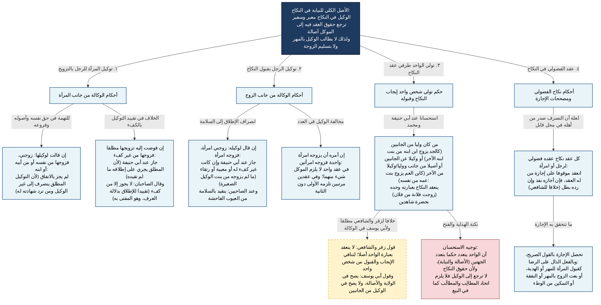

# 03_04 - الوكالة في النكاح وتولي طرفي العقد وعقد الفضولي

```mermaid
flowchart TD
    classDef asl fill:#1e3a5f,stroke:#0f1f33,color:#ffffff,stroke-width:2px
    classDef zahir fill:#e8f4f8,stroke:#2b5c8f,color:#000000,stroke-width:1.5px
    classDef nadire fill:#e2e3e5,stroke:#41464b,color:#000000,stroke-dasharray: 3 3
    classDef hilaf fill:#fff3cd,stroke:#d39e00,color:#000000,stroke-dasharray: 5 5
    classDef serh fill:#f8d7da,stroke:#842029,color:#000000,stroke-width:1px

    ROOT["الأصل الكلي للنيابة في النكاح:<br/>الوكيل في النكاح معبر وسفير ترجع حقوق العقد فيه إلى الموكل أصالة<br/>ولذلك لا يطالب الوكيل بالمهر ولا بتسليم الزوجة"]:::asl

    ROOT -->|"١. توكيل المرأة للرجل بالتزويج"| W["أحكام الوكالة من جانب المرأة"]:::zahir
    W -->|"للتهمة في حق نفسه وأصوله وفروعه"| W1["إن قالت لوكيلها: زوجني، فزوجها من نفسه أو من أبيه أو ابنه:<br/>لم يجز بالاتفاق (لأن التوكيل المطلق ينصرف إلى غير الوكيل ومن ترد شهادته له)"]:::zahir
    W -->|"الخلاف في تقييد التوكيل بالكفء"| W2["إن فوضت إليه تزويجها مطلقا فزوجها من غير كفء:<br/>جاز عند أبي حنيفة (لأن المطلق يجري على إطلاقه ما لم تقيده)<br/>وقال الصاحبان: لا يجوز إلا من كفء (تقييدا للإطلاق بدلالة العرف، وهو المفتى به)"]:::zahir

    ROOT -->|"٢. توكيل الرجل بقبول النكاح"| R["أحكام الوكالة من جانب الزوج"]:::zahir
    R -->|"انصراف الإطلاق إلى السلامة"| R1["إن قال لوكيله: زوجني امرأة، فزوجه امرأة:<br/>جاز عند أبي حنيفة وإن كانت غير كفء له أو معيبة أو رتقاء (ما لم يزوجه من بنت الوكيل الصغيرة)<br/>وعند الصاحبين: يتقيد بالسلامة من العيوب الفاحشة"]:::zahir
    R -->|"مخالفة الوكيل في العدد"| R2["إن أمره أن يزوجه امرأة واحدة فزوجه امرأتين:<br/>في عقد واحد لا يلزم الموكل شيء منهما؛ وفي عقدين مرتبين تلزمه الأولى دون الثانية"]:::zahir

    ROOT -->|"٣. تولي الواحد طرفي عقد النكاح"| T["حكم تولي شخص واحد إيجاب النكاح وقبوله"]:::zahir
    T -->|"استحسانا عند أبي حنيفة ومحمد"| T1["من كان وليا من الجانبين (كالجد يزوج ابن ابنه من بنت ابنه الآخر) أو وكيلا عن الجانبين<br/>أو أصيلا من جانب ووليا/وكيلا من الآخر (كابن العم يزوج بنت عمه من نفسه):<br/>ينعقد النكاح بعبارته وحده (زوجت فلانة من فلان) بحضرة شاهدين"]:::zahir
    T1 -->|"خلافا لزفر والشافعي مطلقا ولأبي يوسف في الوكالة"| TH1["قول زفر والشافعي: لا ينعقد بعبارة الواحد أصلا؛ لتنافي الإيجاب والقبول من شخص واحد<br/>وقول أبي يوسف: يصح في الولاية والأصالة، ولا يصح في الوكيل من الجانبين"]:::hilaf
    T1 -->|"نكتة الهداية والفتح"| TS1["توجيه الاستحسان:<br/>أن الواحد يتعدد حكما بتعدد الجهتين (الأصالة والنيابة)، ولأن حقوق النكاح<br/>لا ترجع إلى الوكيل فلا يلزم اتحاد المطالِب والمطالَب كما في البيع"]:::serh

    ROOT -->|"٤. عقد الفضولي في النكاح"| F["أحكام نكاح الفضولي ومصححات الإجازة"]:::zahir
    F -->|"لعلة أن التصرف صدر من أهله في محل قابل"| F1["كل عقد نكاح عقده فضولي لرجل أو امرأة:<br/>انعقد موقوفا على إجازة من له العقد، فإن أجازه نفذ وإن رده بطل (خلافا للشافعي)"]:::zahir
    F1 -->|"ما تتحقق به الإجازة"| F2["تحصل الإجازة بالقول الصريح، وبالفعل الدال على الرضا:<br/>كقبول المرأة للمهر أو الهدية، أو بعث الزوج بالمهر أو النفقة أو التمكين من الوطء"]:::zahir
```
