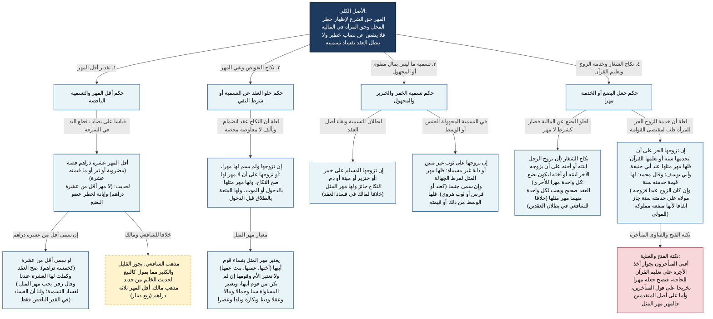

# 04_01 - مقدار المهر ومهر المثل ونكاح التفويض والشغار

```mermaid
flowchart TD
    classDef asl fill:#1e3a5f,stroke:#0f1f33,color:#ffffff,stroke-width:2px
    classDef zahir fill:#e8f4f8,stroke:#2b5c8f,color:#000000,stroke-width:1.5px
    classDef nadire fill:#e2e3e5,stroke:#41464b,color:#000000,stroke-dasharray: 3 3
    classDef hilaf fill:#fff3cd,stroke:#d39e00,color:#000000,stroke-dasharray: 5 5
    classDef serh fill:#f8d7da,stroke:#842029,color:#000000,stroke-width:1px

    ROOT["الأصل الكلي:<br/>المهر حق الشرع لإظهار خطر المحل وحق المرأة في المالية<br/>فلا ينقص عن نصاب خطير ولا يبطل العقد بفساد تسميته"]:::asl

    ROOT -->|"١. تقدير أقل المهر"| M["حكم أقل المهر والتسمية الناقصة"]:::zahir
    M -->|"قياسا على نصاب قطع اليد في السرقة"| M1["أقل المهر عشرة دراهم فضة (مضروبة أو تبر أو ما قيمته عشرة)<br/>لحديث: (لا مهر أقل من عشرة دراهم) وإبانة لخطر عضو البضع"]:::zahir
    M1 -->|"إن سمى أقل من عشرة دراهم"| M2["لو سمى أقل من عشرة (كخمسة دراهم): صح العقد وكملت لها العشرة عندنا<br/>(وقال زفر: يجب مهر المثل لفساد التسمية؛ ولنا أن الفساد في القدر الناقص فقط)"]:::zahir
    M1 -->|"خلافا للشافعي ومالك"| MH["مذهب الشافعي: يجوز القليل والكثير مما يمول كالبيع لحديث الخاتم من حديد<br/>مذهب مالك: أقل المهر ثلاثة دراهم (ربع دينار)"]:::hilaf

    ROOT -->|"٢. نكاح التفويض ونفي المهر"| T["حكم خلو العقد عن التسمية أو شرط النفي"]:::zahir
    T -->|"لعلة أن النكاح عقد انضمام وتآلف لا معاوضة محضة"| T1["إن تزوجها ولم يسم لها مهرا، أو تزوجها على أن لا مهر لها:<br/>صح النكاح، ولها مهر مثلها بالدخول أو الموت، ولها المتعة بالطلاق قبل الدخول"]:::zahir
    T1 -->|"معيار مهر المثل"| T2["يعتبر مهر المثل بنساء قوم أبيها (أختها، عمتها، بنت عمها)<br/>ولا تعتبر الأم وقومها إن لم تكن من قوم أبيها، وتعتبر المساواة سنا وجمالا ومالا وعقلا ودينا وبكارة وبلدا وعصرا"]:::zahir

    ROOT -->|"٣. تسمية ما ليس بمال متقوم أو المجهول"| G["حكم تسمية الخمر والخنزير والمجهول"]:::zahir
    G -->|"لبطلان التسمية وبقاء أصل العقد"| G1["إن تزوجها المسلم على خمر أو خنزير أو ميتة أو دم:<br/>النكاح جائز ولها مهر المثل (خلافا لمالك في فساد العقد)"]:::zahir
    G -->|"في التسمية المجهولة الجنس أو الوسط"| G2["إن تزوجها على ثوب غير مبين أو دابة غير مسماة: فلها مهر المثل لفرط الجهالة<br/>وإن سمى جنسا (كعبد أو فرس أو ثوب هروي): فلها الوسط من ذلك أو قيمته"]:::zahir

    ROOT -->|"٤. نكاح الشغار وخدمة الزوج وتعليم القرآن"| S["حكم جعل البضع أو الخدمة مهرا"]:::zahir
    S -->|"لخلو البضع عن المالية فصار كشرط لا مهر"| S1["نكاح الشغار (أن يزوج الرجل ابنته أو أخته على أن يزوجه الآخر ابنته أو أخته ليكون بضع كل واحدة مهرا للأخرى):<br/>العقد صحيح ويجب لكل واحدة منهما مهر مثلها (خلافا للشافعي في بطلان العقدين)"]:::zahir
    S -->|"لعلة أن خدمة الزوج الحر للمرأة قلب لمقتضى القوامة"| S2["إن تزوجها الحر على أن يخدمها سنة أو يعلمها القرآن:<br/>فلها مهر مثلها عند أبي حنيفة وأبي يوسف؛ وقال محمد: لها قيمة خدمته سنة<br/>(وإن كان الزوج عبدا فزوجه مولاه على خدمته سنة جاز اتفاقا لأنها منفعة مملوكة للمولى)"]:::zahir
    S2 -->|"نكتة الفتح والفتاوى المتأخرة"| SS["نكتة الفتح والعناية:<br/>أفتى المتأخرون بجواز أخذ الأجرة على تعليم القرآن للحاجة، فيصح جعله مهرا<br/>تخريجا على قول المتأخرين، وأما على أصل المتقدمين فالمهر مهر المثل"]:::serh
```
