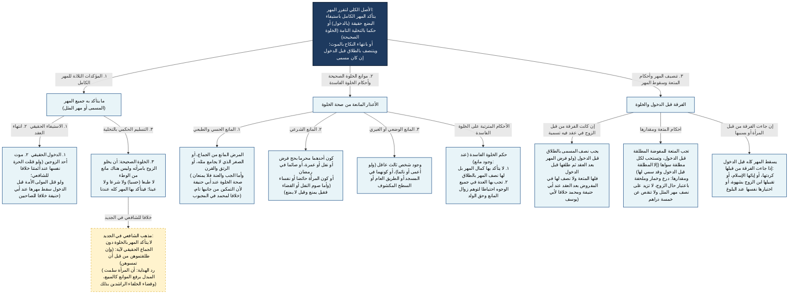

# 04_02 - مؤكدات المهر والخلوة الصحيحة والتنصيف والمتعة

```mermaid
flowchart TD
    classDef asl fill:#1e3a5f,stroke:#0f1f33,color:#ffffff,stroke-width:2px
    classDef zahir fill:#e8f4f8,stroke:#2b5c8f,color:#000000,stroke-width:1.5px
    classDef nadire fill:#e2e3e5,stroke:#41464b,color:#000000,stroke-dasharray: 3 3
    classDef hilaf fill:#fff3cd,stroke:#d39e00,color:#000000,stroke-dasharray: 5 5
    classDef serh fill:#f8d7da,stroke:#842029,color:#000000,stroke-width:1px

    ROOT["الأصل الكلي لتقرر المهر:<br/>يتأكد المهر الكامل باستيفاء البضع حقيقة (بالدخول) أو حكما بالتخلية التامة (الخلوة الصحيحة)<br/>أو بانتهاء النكاح بالموت؛ ويتنصف بالطلاق قبل الدخول إن كان مسمى"]:::asl

    ROOT -->|"١. المؤكدات الثلاثة للمهر الكامل"| A["ما يتأكد به جميع المهر (المسمى أو مهر المثل)"]:::zahir
    A -->|"١. الاستيفاء الحقيقي  ٢. انتهاء العقد"| A1["١. الدخول الحقيقي  ٢. موت أحد الزوجين (ولو قتلت الحرة نفسها عند أئمتنا خلافا للشافعي؛<br/>ولو قتل المولى الأمة قبل الدخول سقط مهرها عند أبي حنيفة خلافا للصاحبين)"]:::zahir
    A -->|"٣. التسليم الحكمي بالتخلية"| A2["٣. الخلوة الصحيحة: أن يخلو الزوج بامرأته وليس هناك مانع من الوطء<br/>لا طبعا (حسيا) ولا شرعا ولا عينا؛ فيتأكد بها المهر كله عندنا"]:::zahir
    A2 -->|"خلافا للشافعي في الجديد"| AH1["مذهب الشافعي في الجديد:<br/>لا يتأكد المهر بالخلوة دون الجماع الحقيقي لآية: (وإن طلقتموهن من قبل أن تمسوهن)<br/>(رد الهداية: أن المرأة سلمت المبدل برفع الموانع كالمبيع، وقضاء الخلفاء الراشدين بذلك)"]:::hilaf

    ROOT -->|"٢. موانع الخلوة الصحيحة وأحكام الخلوة الفاسدة"| M["الأعذار المانعة من صحة الخلوة"]:::zahir
    M -->|"١. المانع الحسي والطبعي"| M1["المرض المانع من الجماع، أو الصغر الذي لا يجامع مثله، أو الرتق والقرن<br/>(وأما الجب والعنة فلا يمنعان صحة الخلوة عند أبي حنيفة لأن التمكين من جانبها تام، خلافا لمحمد في المجبوب)"]:::zahir
    M -->|"٢. المانع الشرعي"| M2["كون أحدهما محرما بحج فرض أو نفل أو عمرة، أو صائما في رمضان<br/>أو كون المرأة حائضا أو نفساء (وأما صوم النفل أو القضاء فقيل يمنع وقيل لا يمنع)"]:::zahir
    M -->|"٣. المانع الوضعي أو الغيري"| M3["وجود شخص ثالث عاقل (ولو أعمى أو نائما)، أو كونهما في المسجد أو الطريق العام أو السطح المكشوف"]:::zahir
    M -->|"الأحكام المترتبة على الخلوة الفاسدة"| M4["حكم الخلوة الفاسدة (عند وجود مانع):<br/>١. لا يتأكد بها كمال المهر بل لها نصف المهر بالطلاق<br/>٢. تجب بها العدة في جميع الوجوه احتياطا لتوهم زوال المانع وحق الولد"]:::zahir

    ROOT -->|"٣. تنصيف المهر وأحكام المتعة وسقوط المهر"| T["الفرقة قبل الدخول والخلوة"]:::zahir
    T -->|"إن كانت الفرقة من قبل الزوج في عقد فيه تسمية"| T1["يجب نصف المسمى بالطلاق قبل الدخول (ولو فرض المهر بعد العقد ثم طلقها قبل الدخول<br/>فلها المتعة ولا نصف لها في المفروض بعد العقد عند أبي حنيفة ومحمد خلافا لأبي يوسف)"]:::zahir
    T -->|"أحكام المتعة ومقدارها"| T2["تجب المتعة للمفوضة المطلقة قبل الدخول، وتستحب لكل مطلقة سواها (إلا المطلقة قبل الدخول وقد سمي لها)<br/>ومقدارها: درع وخمار وملحفة باعتبار حال الزوج، لا تزيد على نصف مهر المثل ولا تنقص عن خمسة دراهم"]:::zahir
    T -->|"إن جاءت الفرقة من قبل المرأة أو بسببها"| T3["يسقط المهر كله قبل الدخول إذا جاءت الفرقة من قبلها:<br/>كردتها، أو إبائها الإسلام، أو تقبيلها ابن الزوج بشهوة، أو اختيارها نفسها عند البلوغ"]:::zahir
```
