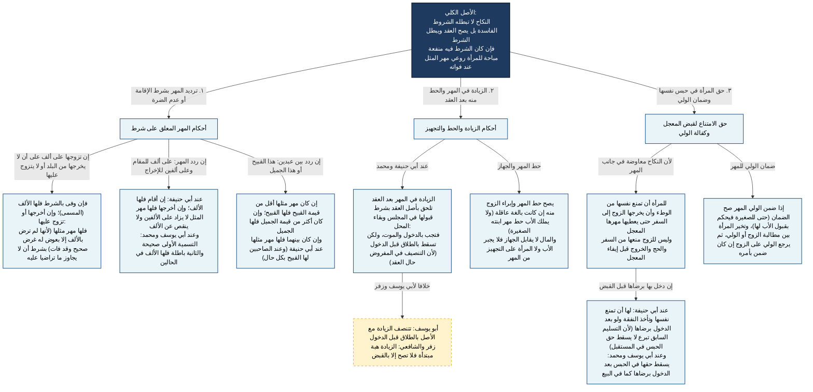

# 04_03 - الشروط المقترنة بالمهر والزيادة والحط والجهاز وحق الحبس

```mermaid
flowchart TD
    classDef asl fill:#1e3a5f,stroke:#0f1f33,color:#ffffff,stroke-width:2px
    classDef zahir fill:#e8f4f8,stroke:#2b5c8f,color:#000000,stroke-width:1.5px
    classDef nadire fill:#e2e3e5,stroke:#41464b,color:#000000,stroke-dasharray: 3 3
    classDef hilaf fill:#fff3cd,stroke:#d39e00,color:#000000,stroke-dasharray: 5 5
    classDef serh fill:#f8d7da,stroke:#842029,color:#000000,stroke-width:1px

    ROOT["الأصل الكلي:<br/>النكاح لا تبطله الشروط الفاسدة بل يصح العقد ويبطل الشرط<br/>فإن كان الشرط فيه منفعة مباحة للمرأة روعي مهر المثل عند فواته"]:::asl

    ROOT -->|"١. ترديد المهر بشرط الإقامة أو عدم الضرة"| S["أحكام المهر المعلق على شرط"]:::zahir
    S -->|"إن تزوجها على ألف على أن لا يخرجها من البلد أو لا يتزوج عليها"| S1["فإن وفى بالشرط فلها الألف (المسمى)؛ وإن أخرجها أو تزوج عليها:<br/>فلها مهر مثلها (لأنها لم ترض بالألف إلا بعوض له غرض صحيح وقد فات) بشرط أن لا يجاوز ما تراضيا عليه"]:::zahir
    S -->|"إن ردد المهر: على ألف للمقام وعلى ألفين للإخراج"| S2["عند أبي حنيفة: إن أقام فلها الألف؛ وإن أخرجها فلها مهر المثل لا يزاد على الألفين ولا ينقص عن الألف<br/>وعند أبي يوسف ومحمد: التسمية الأولى صحيحة والثانية باطلة فلها الألف في الحالين"]:::zahir
    S -->|"إن ردد بين عبدين: هذا القبيح أو هذا الجميل"| S3["إن كان مهر مثلها أقل من قيمة القبيح فلها القبيح؛ وإن كان أكثر من قيمة الجميل فلها الجميل<br/>وإن كان بينهما فلها مهر مثلها عند أبي حنيفة (وعند الصاحبين لها القبيح بكل حال)"]:::zahir

    ROOT -->|"٢. الزيادة في المهر والحط منه بعد العقد"| Z["أحكام الزيادة والحط والتجهيز"]:::zahir
    Z -->|"عند أبي حنيفة ومحمد"| Z1["الزيادة في المهر بعد العقد تلحق بأصل العقد بشرط قبولها في المجلس وبقاء المحل:<br/>فتجب بالدخول والموت، ولكن تسقط بالطلاق قبل الدخول (لأن التنصيف في المفروض حال العقد)"]:::zahir
    Z1 -->|"خلافا لأبي يوسف وزفر"| ZH1["أبو يوسف: تتنصف الزيادة مع الأصل بالطلاق قبل الدخول<br/>زفر والشافعي: الزيادة هبة مبتدأة فلا تصح إلا بالقبض"]:::hilaf
    Z -->|"حط المهر والجهاز"| Z2["يصح حط المهر وإبراء الزوج منه إن كانت بالغة عاقلة (ولا يملك الأب حط مهر ابنته الصغيرة)<br/>والمال لا يقابل الجهاز فلا يجبر الأب ولا المرأة على التجهيز من المهر"]:::zahir

    ROOT -->|"٣. حق المرأة في حبس نفسها وضمان الولي"| H["حق الامتناع لقبض المعجل وكفالة الولي"]:::zahir
    H -->|"لأن النكاح معاوضة في جانب المهر"| H1["للمرأة أن تمنع نفسها من الوطء وأن يخرجها الزوج إلى السفر حتى يعطيها مهرها المعجل<br/>وليس للزوج منعها من السفر والحج والخروج قبل إيفاء المعجل"]:::zahir
    H1 -->|"إن دخل بها برضاها قبل القبض"| H2["عند أبي حنيفة: لها أن تمنع نفسها وتأخذ النفقة ولو بعد الدخول برضاها (لأن التسليم السابق تبرع لا يسقط حق الحبس في المستقبل)<br/>وعند أبي يوسف ومحمد: يسقط حقها في الحبس بعد الدخول برضاها كما في البيع"]:::zahir
    H -->|"ضمان الولي للمهر"| H3["إذا ضمن الولي المهر صح الضمان (حتى للصغيرة فيحكم بقبول الأب لها)، وتخير المرأة بين مطالبة الزوج أو الولي، ثم يرجع الولي على الزوج إن كان ضمن بأمره"]:::zahir
```
