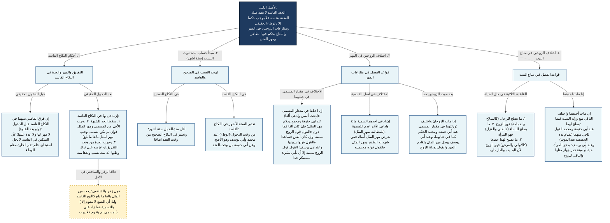

# 04_04 - النكاح الفاسد وثبوت النسب واختلاف الزوجين في المهر ومتاع البيت

```mermaid
flowchart TD
    classDef asl fill:#1e3a5f,stroke:#0f1f33,color:#ffffff,stroke-width:2px
    classDef zahir fill:#e8f4f8,stroke:#2b5c8f,color:#000000,stroke-width:1.5px
    classDef nadire fill:#e2e3e5,stroke:#41464b,color:#000000,stroke-dasharray: 3 3
    classDef hilaf fill:#fff3cd,stroke:#d39e00,color:#000000,stroke-dasharray: 5 5
    classDef serh fill:#f8d7da,stroke:#842029,color:#000000,stroke-width:1px

    ROOT["الأصل الكلي:<br/>العقد الفاسد لا يفيد ملك المتعة بنفسه فلا يوجب حكما إلا بالوطء الحقيقي<br/>ومنازعات الزوجين في المهر والمتاع يحكم فيها الظاهر ومهر المثل"]:::asl

    ROOT -->|"١. أحكام النكاح الفاسد"| F["التفريق والمهر والعدة في النكاح الفاسد"]:::zahir
    F -->|"قبل الدخول الحقيقي"| F1["إن فرق القاضي بينهما في النكاح الفاسد قبل الدخول (ولو بعد الخلوة):<br/>لا مهر لها ولا عدة عليها؛ لأن التمكين في الفاسد لا يحل استيفاؤه فلم تقم الخلوة مقام الوطء"]:::zahir
    F -->|"بعد الدخول الحقيقي"| F2["إن دخل بها في النكاح الفاسد:<br/>١. سقط الحد للشبهة  ٢. وجب الأقل من المسمى ومهر المثل (وإن لم يكن مسمى وجب مهر المثل بالغا ما بلغ)<br/>٣. وجبت العدة من وقت التفريق أو عزمه على ترك وطئها  ٤. ثبت نسب ولدها منه"]:::zahir
    F2 -->|"خلافا لزفر والشافعي في الأقل"| FH1["قول زفر والشافعي: يجب مهر المثل بالغا ما بلغ كالبيع الفاسد<br/>(ولنا: أن البضع لا يتقوم إلا بالتسمية فما زاد على المسمى لم يتقوم فلا يجب)"]:::hilaf

    ROOT -->|"٢. مبدأ حساب مدة ثبوت النسب (ستة أشهر)"| N["ثبوت النسب في الصحيح والفاسد"]:::zahir
    N -->|"في النكاح الصحيح"| N1["أقل مدة الحمل ستة أشهر؛ وتعتبر في النكاح الصحيح من وقت العقد اتفاقا"]:::zahir
    N -->|"في النكاح الفاسد"| N2["تعتبر الستة الأشهر في النكاح الفاسد:<br/>من وقت الدخول (الوطء) عند محمد وأبي يوسف وهو الأصح، وعن أبي حنيفة من وقت العقد"]:::zahir

    ROOT -->|"٣. اختلاف الزوجين في المهر"| I["قواعد الفصل في منازعات المهر"]:::zahir
    I -->|"الاختلاف في مقدار المسمى في حياتهما"| I1["إن اختلفا في مقدار المسمى (ادعت ألفين وادعى ألفا):<br/>عند أبي حنيفة ومحمد يحكم مهر المثل؛ فإن كان ألفا فما دون فالقول قول الزوج بيمينه، وإن كان ألفين فصاعدا فالقول قولها بيمينها<br/>وعند أبي يوسف: القول قول الزوج بيمينه إلا أن يأتي بشيء مستنكر جدا"]:::zahir
    I -->|"الاختلاف في أصل التسمية"| I2["إن ادعى أحدهما تسمية مائة وادعى الآخر عدم التسمية (للمطالبة بمهر المثل):<br/>يفرض مهر المثل أصلا، فمن شهد له الظاهر بمهر المثل فالقول قوله مع يمينه"]:::zahir
    I -->|"بعد موت الزوجين معا"| I3["إذا مات الزوجان واختلف ورثتهما في مقدار المسمى:<br/>عند أبي حنيفة ومحمد الحكم كما في حياتهما، وعند أبي يوسف يبطل مهر المثل بتقادم العهد والقول لورثة الزوج"]:::zahir

    ROOT -->|"٤. اختلاف الزوجين في متاع البيت"| B["قواعد الفصل في متاع البيت"]:::zahir
    B -->|"القاعدة الثلاثية في حال الحياة"| B1["١. ما يصلح للرجال (كالسلاح والعمامة) فهو للزوج  ٢. ما يصلح للنساء (كالحلي والغزل) فهو للمرأة<br/>٣. ما يصلح لهما جميعا (كالأواني والفرش) فهو للزوج لأن اليد يده والدار داره"]:::zahir
    B -->|"إذا مات أحدهما"| B2["إن مات أحدهما واختلف الباقي مع ورثة الميت فيما يصلح لهما:<br/>عند أبي حنيفة ومحمد القول للحي منهما (لقيام يده الحقيقية بعد الموت)<br/>وعند أبي يوسف: يدفع للمرأة حية أو ميتة قدر جهاز مثلها والباقي للزوج"]:::zahir
```
