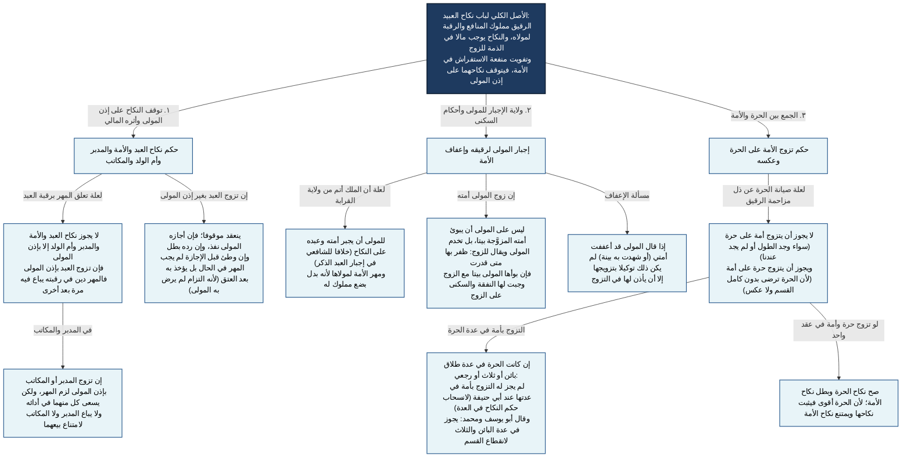

# 05_01 - نكاح الرقيق بإذن المولى ومحل المهر ونكاح الأمة على الحرة

```mermaid
flowchart TD
    classDef asl fill:#1e3a5f,stroke:#0f1f33,color:#ffffff,stroke-width:2px
    classDef zahir fill:#e8f4f8,stroke:#2b5c8f,color:#000000,stroke-width:1.5px
    classDef nadire fill:#e2e3e5,stroke:#41464b,color:#000000,stroke-dasharray: 3 3
    classDef hilaf fill:#fff3cd,stroke:#d39e00,color:#000000,stroke-dasharray: 5 5
    classDef serh fill:#f8d7da,stroke:#842029,color:#000000,stroke-width:1px

    ROOT["الأصل الكلي لباب نكاح العبيد:<br/>الرقيق مملوك المنافع والرقبة لمولاه، والنكاح يوجب مالا في الذمة للزوج<br/>وتفويت منفعة الاستفراش في الأمة، فيتوقف نكاحهما على إذن المولى"]:::asl

    ROOT -->|"١. توقف النكاح على إذن المولى وأثره المالي"| A["حكم نكاح العبد والأمة والمدبر وأم الولد والمكاتب"]:::zahir
    A -->|"لعلة تعلق المهر برقبة العبد"| A1["لا يجوز نكاح العبد والأمة والمدبر وأم الولد إلا بإذن المولى<br/>فإن تزوج العبد بإذن المولى فالمهر دين في رقبته يباع فيه مرة بعد أخرى"]:::zahir
    A1 -->|"في المدبر والمكاتب"| A2["إن تزوج المدبر أو المكاتب بإذن المولى لزم المهر، ولكن يسعى كل منهما في أدائه<br/>ولا يباع المدبر ولا المكاتب لامتناع بيعهما"]:::zahir
    A -->|"إن تزوج العبد بغير إذن المولى"| A3["ينعقد موقوفا؛ فإن أجازه المولى نفذ، وإن رده بطل<br/>وإن وطئ قبل الإجازة لم يجب المهر في الحال بل يؤخذ به بعد العتق (لأنه التزام لم يرض به المولى)"]:::zahir

    ROOT -->|"٢. ولاية الإجبار للمولى وأحكام السكنى"| B["إجبار المولى لرقيقه وإعفاف الأمة"]:::zahir
    B -->|"لعلة أن الملك أتم من ولاية القرابة"| B1["للمولى أن يجبر أمته وعبده على النكاح (خلافا للشافعي في إجبار العبد الذكر)<br/>ومهر الأمة لمولاها لأنه بدل بضع مملوك له"]:::zahir
    B -->|"إن زوج المولى أمته"| B2["ليس على المولى أن يبوئ أمته المزوَّجة بيتا، بل تخدم المولى ويقال للزوج: ظفر بها متى قدرت<br/>فإن بوأها المولى بيتا مع الزوج وجبت لها النفقة والسكنى على الزوج"]:::zahir
    B -->|"مسألة الإعفاف"| B3["إذا قال المولى قد أعففت أمتي (أو شهدت به بينة) لم يكن ذلك توكيلا بتزويجها<br/>إلا أن يأذن لها في التزوج"]:::zahir

    ROOT -->|"٣. الجمع بين الحرة والأمة"| C["حكم تزوج الأمة على الحرة وعكسه"]:::zahir
    C -->|"لعلة صيانة الحرة عن ذل مزاحمة الرقيق"| C1["لا يجوز أن يتزوج أمة على حرة (سواء وجد الطول أو لم يجد عندنا)<br/>ويجوز أن يتزوج حرة على أمة (لأن الحرة ترضى بدون كامل القسم ولا عكس)"]:::zahir
    C1 -->|"التزوج بأمة في عدة الحرة"| C2["إن كانت الحرة في عدة طلاق بائن أو ثلاث أو رجعي:<br/>لم يجز له التزوج بأمة في عدتها عند أبي حنيفة (لانسحاب حكم النكاح في العدة)<br/>وقال أبو يوسف ومحمد: يجوز في عدة البائن والثلاث لانقطاع القسم"]:::zahir
    C1 -->|"لو تزوج حرة وأمة في عقد واحد"| C3["صح نكاح الحرة وبطل نكاح الأمة؛ لأن الحرة أقوى فيثبت نكاحها ويمتنع نكاح الأمة"]:::zahir
```
