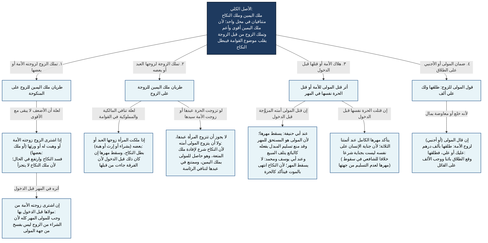

# 05_02 - تملك أحد الزوجين صاحبه وأثر قتل المولى للأمة قبل الدخول

```mermaid
flowchart TD
    classDef asl fill:#1e3a5f,stroke:#0f1f33,color:#ffffff,stroke-width:2px
    classDef zahir fill:#e8f4f8,stroke:#2b5c8f,color:#000000,stroke-width:1.5px
    classDef nadire fill:#e2e3e5,stroke:#41464b,color:#000000,stroke-dasharray: 3 3
    classDef hilaf fill:#fff3cd,stroke:#d39e00,color:#000000,stroke-dasharray: 5 5
    classDef serh fill:#f8d7da,stroke:#842029,color:#000000,stroke-width:1px

    ROOT["الأصل الكلي:<br/>ملك اليمين وملك النكاح متنافيان في محل واحد؛ لأن ملك اليمين أقوى وأعم<br/>وتملك الزوج من قبل الزوجة يقلب موضوع القوامة فيبطل النكاح"]:::asl

    ROOT -->|"١. تملك الزوج لزوجته الأمة أو بعضها"| A["طريان ملك اليمين للزوج على المنكوحة"]:::zahir
    A -->|"لعلة أن الأضعف لا يبقى مع الأقوى"| A1["إذا اشترى الزوج زوجته الأمة أو وهبت له أو ورثها (أو ملك بعضها):<br/>فسد النكاح وارتفع في الحال؛ لأن ملك النكاح لا يتجزأ"]:::zahir
    A1 -->|"أثره في المهر قبل الدخول"| A2["إن اشترى زوجته الأمة من مولاها قبل الدخول بها:<br/>وجب للمولى المهر كله لأن الشراء من الزوج ليس بفسخ من جهة المولى"]:::zahir

    ROOT -->|"٢. تملك الزوجة لزوجها العبد أو بعضه"| B["طريان ملك اليمين للزوجة على الزوج"]:::zahir
    B -->|"لعلة تنافي المالكية والمملوكية في القوامة"| B1["إذا ملكت المرأة زوجها العبد أو بعضه (بشراء أو إرث أو هبة):<br/>بطل النكاح، وسقط مهرها إن كان ذلك قبل الدخول لأن الفرقة جاءت من قبلها"]:::zahir
    B -->|"لو تزوجت الحرة عبدها أو زوجت الأمة سيدها"| B2["لا يجوز أن تتزوج المرأة عبدها، ولا أن يتزوج المولى أمته:<br/>لأن النكاح شرع لإفادة ملك المتعة، وهو حاصل للمولى بملك اليمين، وممتنع في عبدها لتنافي الرئاسة"]:::zahir

    ROOT -->|"٣. هلاك الأمة أو قتلها قبل الدخول"| C["أثر قتل المولى للأمة أو قتل الحرة نفسها في المهر"]:::zahir
    C -->|"إن قتل المولى أمته المزوَّجة قبل الدخول"| C1["عند أبي حنيفة: يسقط مهرها؛ لأن المولى هو المستحق للمهر وقد منع تسليم المبدل بفعله كالبائع يتلف المبيع<br/>وعند أبي يوسف ومحمد: لا يسقط المهر؛ لأن النكاح انتهى بالموت فيتأكد كالحرة"]:::zahir
    C -->|"إن قتلت الحرة نفسها قبل الدخول"| C2["يتأكد مهرها الكامل عند أئمتنا الثلاثة؛ لأن جناية الإنسان على نفسه ليست بجناية شرعا<br/>(خلافا للشافعي في سقوط مهرها لعدم التسليم من جهتها)"]:::zahir

    ROOT -->|"٤. ضمان المولى أو الأجنبي على الطلاق"| D["قول المولى للزوج: طلقها ولك علي ألف"]:::zahir
    D -->|"لأنه خلع أو معاوضة بمال"| D1["إن قال المولى (أو أجنبي) لزوج الأمة: طلقها بألف درهم عليك أو علي، فطلقها:<br/>وقع الطلاق بائنا ووجب الألف على القائل"]:::zahir
```
