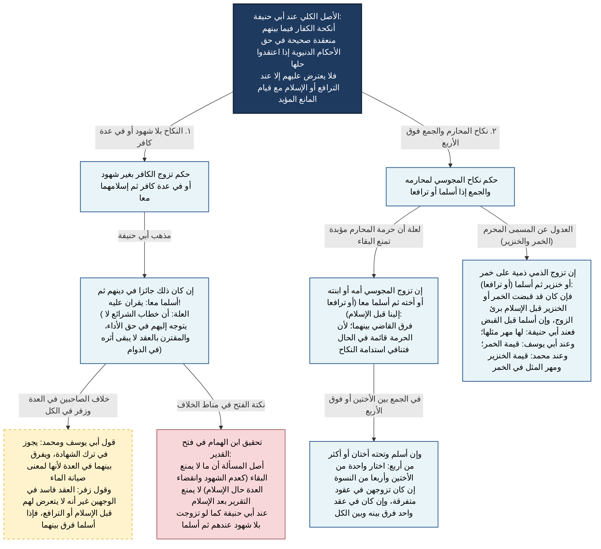

# 06_01 - أنكحة الكفار بلا شهود أو في العدة أو المحارم وإسلامهما معاً

```mermaid
flowchart TD
    classDef asl fill:#1e3a5f,stroke:#0f1f33,color:#ffffff,stroke-width:2px
    classDef zahir fill:#e8f4f8,stroke:#2b5c8f,color:#000000,stroke-width:1.5px
    classDef nadire fill:#e2e3e5,stroke:#41464b,color:#000000,stroke-dasharray: 3 3
    classDef hilaf fill:#fff3cd,stroke:#d39e00,color:#000000,stroke-dasharray: 5 5
    classDef serh fill:#f8d7da,stroke:#842029,color:#000000,stroke-width:1px

    ROOT["الأصل الكلي عند أبي حنيفة:<br/>أنكحة الكفار فيما بينهم منعقدة صحيحة في حق الأحكام الدنيوية إذا اعتقدوا حلها<br/>فلا يعترض عليهم إلا عند الترافع أو الإسلام مع قيام المانع المؤبد"]:::asl

    ROOT -->|"١. النكاح بلا شهود أو في عدة كافر"| A["حكم تزوج الكافر بغير شهود أو في عدة كافر ثم إسلامهما معا"]:::zahir
    A -->|"مذهب أبي حنيفة"| A1["إن كان ذلك جائزا في دينهم ثم أسلما معا: يقران عليه!<br/>(العلة: أن خطاب الشرائع لا يتوجه إليهم في حق الأداء، والمقترن بالعقد لا يبقى أثره في الدوام)"]:::zahir
    A1 -->|"خلاف الصاحبين في العدة وزفر في الكل"| AH1["قول أبي يوسف ومحمد: يجوز في ترك الشهادة، ويفرق بينهما في العدة لأنها لمعنى صيانة الماء<br/>وقول زفر: العقد فاسد في الوجهين غير أنه لا يتعرض لهم قبل الإسلام أو الترافع، فإذا أسلما فرق بينهما"]:::hilaf
    A1 -->|"نكتة الفتح في مناط الخلاف"| AS["تحقيق ابن الهمام في فتح القدير:<br/>أصل المسألة أن ما لا يمنع البقاء (كعدم الشهود وانقضاء العدة حال الإسلام) لا يمنع التقرير بعد الإسلام<br/>عند أبي حنيفة كما لو تزوجت بلا شهود عندهم ثم أسلما"]:::serh

    ROOT -->|"٢. نكاح المحارم والجمع فوق الأربع"| B["حكم نكاح المجوسي لمحارمه والجمع إذا أسلما أو ترافعا"]:::zahir
    B -->|"لعلة أن حرمة المحارم مؤبدة تمنع البقاء"| B1["إن تزوج المجوسي أمه أو ابنته أو أخته ثم أسلما معا (أو ترافعا إلينا قبل الإسلام):<br/>فرق القاضي بينهما؛ لأن الحرمة قائمة في الحال فتنافي استدامة النكاح"]:::zahir
    B1 -->|"في الجمع بين الأختين أو فوق الأربع"| B2["وإن أسلم وتحته أختان أو أكثر من أربع: اختار واحدة من الأختين وأربعا من النسوة<br/>إن كان تزوجهن في عقود متفرقة، وإن كان في عقد واحد فرق بينه وبين الكل"]:::zahir
    B -->|"العدول عن المسمى المحرم (الخمر والخنزير)"| B3["إن تزوج الذمي ذمية على خمر أو خنزير ثم أسلما (أو ترافعا):<br/>فإن كان قد قبضت الخمر أو الخنزير قبل الإسلام برئ الزوج، وإن أسلما قبل القبض<br/>فعند أبي حنيفة: لها مهر مثلها؛ وعند أبي يوسف: قيمة الخمر؛ وعند محمد: قيمة الخنزير ومهر المثل في الخمر"]:::zahir
```
