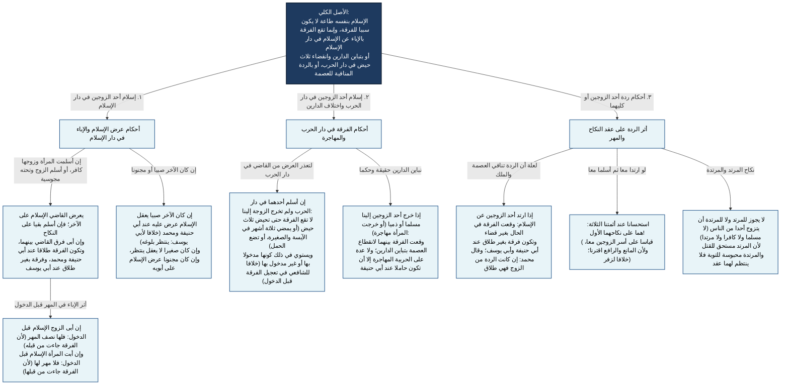

# 06_02 - إسلام أحد الزوجين في دار الإسلام أو الحرب وأحكام الردة

```mermaid
flowchart TD
    classDef asl fill:#1e3a5f,stroke:#0f1f33,color:#ffffff,stroke-width:2px
    classDef zahir fill:#e8f4f8,stroke:#2b5c8f,color:#000000,stroke-width:1.5px
    classDef nadire fill:#e2e3e5,stroke:#41464b,color:#000000,stroke-dasharray: 3 3
    classDef hilaf fill:#fff3cd,stroke:#d39e00,color:#000000,stroke-dasharray: 5 5
    classDef serh fill:#f8d7da,stroke:#842029,color:#000000,stroke-width:1px

    ROOT["الأصل الكلي:<br/>الإسلام بنفسه طاعة لا يكون سببا للفرقة، وإنما تقع الفرقة بالإباء عن الإسلام في دار الإسلام<br/>أو بتباين الدارين وانقضاء ثلاث حيض في دار الحرب، أو بالردة المنافية للعصمة"]:::asl

    ROOT -->|"١. إسلام أحد الزوجين في دار الإسلام"| A["أحكام عرض الإسلام والإباء في دار الإسلام"]:::zahir
    A -->|"إن أسلمت المرأة وزوجها كافر، أو أسلم الزوج وتحته مجوسية"| A1["يعرض القاضي الإسلام على الآخر؛ فإن أسلم بقيا على النكاح<br/>وإن أبى فرق القاضي بينهما، وتكون الفرقة طلاقا عند أبي حنيفة ومحمد، وفرقة بغير طلاق عند أبي يوسف"]:::zahir
    A1 -->|"أثر الإباء في المهر قبل الدخول"| A2["إن أبى الزوج الإسلام قبل الدخول: فلها نصف المهر (لأن الفرقة جاءت من قبله)<br/>وإن أبت المرأة الإسلام قبل الدخول: فلا مهر لها (لأن الفرقة جاءت من قبلها)"]:::zahir
    A -->|"إن كان الآخر صبيا أو مجنونا"| A3["إن كان الآخر صبيا يعقل الإسلام عرض عليه عند أبي حنيفة ومحمد (خلافا لأبي يوسف: ينتظر بلوغه)<br/>وإن كان صغيرا لا يعقل ينتظر، وإن كان مجنونا عرض الإسلام على أبويه"]:::zahir

    ROOT -->|"٢. إسلام أحد الزوجين في دار الحرب واختلاف الدارين"| B["أحكام الفرقة في دار الحرب والمهاجرة"]:::zahir
    B -->|"لتعذر العرض من القاضي في دار الحرب"| B1["إن أسلم أحدهما في دار الحرب ولم تخرج الزوجة إلينا:<br/>لا تقع الفرقة حتى تحيض ثلاث حيض (أو يمضي ثلاثة أشهر في الآيسة والصغيرة، أو تضع الحمل)<br/>ويستوي في ذلك كونها مدخولا بها أو غير مدخول بها (خلافا للشافعي في تعجيل الفرقة قبل الدخول)"]:::zahir
    B -->|"تباين الدارين حقيقة وحكما"| B2["إذا خرج أحد الزوجين إلينا مسلما أو ذميا (أو خرجت المرأة مهاجرة):<br/>وقعت الفرقة بينهما لانقطاع العصمة بتباين الدارين؛ ولا عدة على الحربية المهاجرة إلا أن تكون حاملا عند أبي حنيفة"]:::zahir

    ROOT -->|"٣. أحكام ردة أحد الزوجين أو كليهما"| C["أثر الردة على عقد النكاح والمهر"]:::zahir
    C -->|"لعلة أن الردة تنافي العصمة والملك"| C1["إذا ارتد أحد الزوجين عن الإسلام: وقعت الفرقة في الحال بغير قضاء<br/>وتكون فرقة بغير طلاق عند أبي حنيفة وأبي يوسف؛ وقال محمد: إن كانت الردة من الزوج فهي طلاق"]:::zahir
    C -->|"لو ارتدا معا ثم أسلما معا"| C2["استحسانا عند أئمتنا الثلاثة: هما على نكاحهما الأول!<br/>(قياسا على أسر الزوجين معا، ولأن المانع والرافع اقترنا؛ خلافا لزفر)"]:::zahir
    C -->|"نكاح المرتد والمرتدة"| C3["لا يجوز للمرتد ولا للمرتدة أن يتزوج أحدا من الناس (لا مسلما ولا كافرا ولا مرتدا)<br/>لأن المرتد مستحق للقتل والمرتدة محبوسة للتوبة فلا ينتظم لهما عقد"]:::zahir
```
