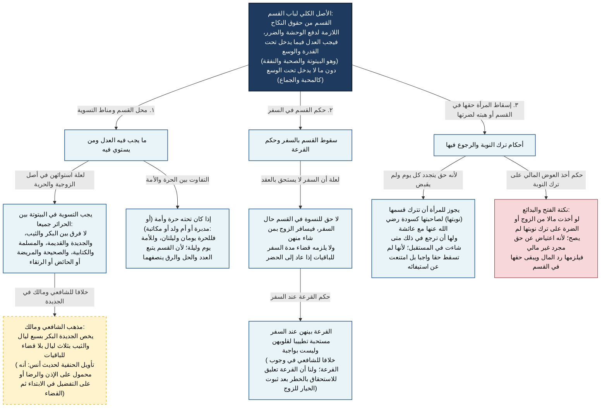

# 07_01 - باب القسم بين الزوجات وشروطه وسقوطه في السفر

```mermaid
flowchart TD
    classDef asl fill:#1e3a5f,stroke:#0f1f33,color:#ffffff,stroke-width:2px
    classDef zahir fill:#e8f4f8,stroke:#2b5c8f,color:#000000,stroke-width:1.5px
    classDef nadire fill:#e2e3e5,stroke:#41464b,color:#000000,stroke-dasharray: 3 3
    classDef hilaf fill:#fff3cd,stroke:#d39e00,color:#000000,stroke-dasharray: 5 5
    classDef serh fill:#f8d7da,stroke:#842029,color:#000000,stroke-width:1px

    ROOT["الأصل الكلي لباب القسم:<br/>القسم من حقوق النكاح اللازمة لدفع الوحشة والضرر، فيجب العدل فيما يدخل تحت القدرة والوسع<br/>(وهو البيتوتة والصحبة والنفقة) دون ما لا يدخل تحت الوسع (كالمحبة والجماع)"]:::asl

    ROOT -->|"١. محل القسم ومناط التسوية"| A["ما يجب فيه العدل ومن يستوي فيه"]:::zahir
    A -->|"لعلة استوائهن في أصل الزوجية والحرية"| A1["يجب التسوية في البيتوتة بين الحرائر جميعا:<br/>لا فرق بين البكر والثيب، والجديدة والقديمة، والمسلمة والكتابية، والصحيحة والمريضة أو الحائض أو الرتقاء"]:::zahir
    A1 -->|"خلافا للشافعي ومالك في الجديدة"| AH1["مذهب الشافعي ومالك:<br/>يخص الجديدة البكر بسبع ليال والثيب بثلاث ليال بلا قضاء للباقيات<br/>(تأويل الحنفية لحديث أنس: أنه محمول على الإذن والرضا أو على التفضيل في الابتداء ثم القضاء)"]:::hilaf
    A -->|"التفاوت بين الحرة والأمة"| A2["إذا كان تحته حرة وأمة (أو مدبرة أو أم ولد أو مكاتبة):<br/>فللحرة يومان وليلتان، وللأمة يوم وليلة؛ لأن القسم يتبع العدد والحل والرق ينصفهما"]:::zahir

    ROOT -->|"٢. حكم القسم في السفر"| B["سقوط القسم بالسفر وحكم القرعة"]:::zahir
    B -->|"لعلة أن السفر لا يستحق بالعقد"| B1["لا حق للنسوة في القسم حال السفر، فيسافر الزوج بمن شاء منهن<br/>ولا يلزمه قضاء مدة السفر للباقيات إذا عاد إلى الحضر"]:::zahir
    B1 -->|"حكم القرعة عند السفر"| B2["القرعة بينهن عند السفر مستحبة تطييبا لقلوبهن وليست بواجبة<br/>(خلافا للشافعي في وجوب القرعة؛ ولنا أن القرعة تعليق للاستحقاق بالخطر بعد ثبوت الخيار للزوج)"]:::zahir

    ROOT -->|"٣. إسقاط المرأة حقها في القسم أو هبته لضرتها"| C["أحكام ترك النوبة والرجوع فيها"]:::zahir
    C -->|"لأنه حق يتجدد كل يوم ولم يقبض"| C1["يجوز للمرأة أن تترك قسمها (نوبتها) لصاحبتها كسودة رضي الله عنها مع عائشة<br/>ولها أن ترجع في ذلك متى شاءت في المستقبل؛ لأنها لم تسقط حقا واجبا بل امتنعت عن استيفائه"]:::zahir
    C -->|"حكم أخذ العوض المالي على ترك النوبة"| C2["نكتة الفتح والبدائع:<br/>لو أخذت مالا من الزوج أو الضرة على ترك نوبتها لم يصح؛ لأنه اعتياض عن حق مجرد غير مالي<br/>فيلزمها رد المال ويبقى حقها في القسم"]:::serh
```
